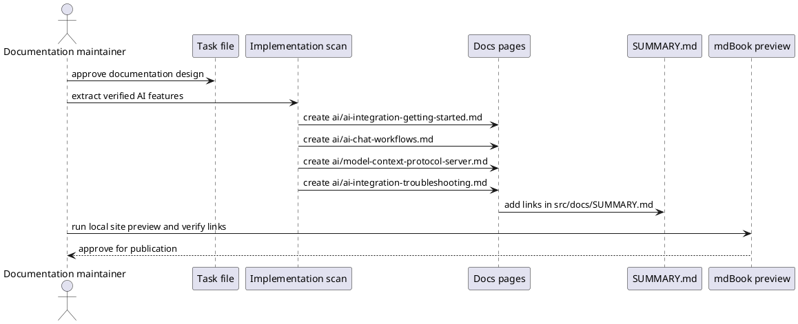

# Task: Document Freeplane AI Integration
- **Task Identifier:** 2026-02-13-ai-integration
- **Scope:** Add end-user and contributor documentation for Freeplane AI
  integration, covering setup, chat usage, map-aware tool calls,
  profiles, and MCP server access.
- **Motivation:** The AI plugin now contains substantial functionality,
  but the docs site does not yet provide a coherent entry point and
  usage guide for users evaluating or adopting AI-assisted workflows in
  Freeplane.
- **Developer Briefing:** This task prepares the documentation design
  and test specification only. No code until design suggestions
  approved.
- **Research:**
  - Existing implementation is in
    `/Users/dimitry/git-repo/freeplane/freeplane/freeplane_plugin_ai`
    with key areas under `chat`, `tools`, `mcpserver`, and provider
    configuration classes.
  - Existing AI planning/implementation history is documented in
    `/Users/dimitry/git-repo/freeplane/freeplane/ai-specs/tasks/done`,
    including tasks for MCP server support, profile management,
    transcript memory behavior, and tool call summaries.
  - The plugin README currently documents provider setup for OpenRouter
    and Ollama, including required property names and key sources.
  - The docs repository currently has no dedicated AI integration
    section under `src/docs`.
  - Forum user feedback confirms real daily usage with three concrete
    successful agent workflows:
    spelling correction over branch nodes with suggested child nodes,
    summarization of node notes (including notes manually extracted from
    PDFs by the user), and
    drafting decision text.
  - Forum feedback also confirms recent-message deletion controls are
    working as expected and should be reflected in chat workflow
    guidance.
- **Design:**

Documentation files proposed by this design:
- `src/docs/ai/ai-integration-getting-started.md`:
  prerequisites, provider setup, and first chat.
- `src/docs/ai/ai-chat-workflows.md`:
  map-aware prompting, tool behavior, and profile usage.
  Include end-to-end examples based on reported workflows:
  - Spelling correction agent for a selected branch, writing suggested
    corrected text into child nodes when changes are needed.
  - Notes summarization agent for long note content, including notes
    manually extracted from PDFs by the user.
  - Decision drafting agent that converts map context into decision
    proposals.
- `src/docs/ai/model-context-protocol-server.md`:
  local server enablement, token header usage, and safety notes.
- `src/docs/ai/ai-integration-troubleshooting.md`:
  model/provider issues and expected failure modes.
  Include a short "known-good outcomes" checklist referencing:
  - recent-message deletion in chat history,
  - stable agent execution for branch-level text processing,
  - practical daily workflow adoption signals.
- `src/docs/SUMMARY.md`:
  navigation entries for the new `ai/` section and pages.
- **Test specification:**
  - Automated tests:
    - Run markdown/link validation available in this repository (if
      configured) to verify new links and image references.
  - Manual tests:
    - Build local docs preview with `mdbook serve src --dest-dir
      ../build/gh-pages -p 3000` and verify page rendering.
    - Validate that all new pages are reachable from
      `src/docs/SUMMARY.md`.
    - Verify setup snippets against plugin properties currently used in
      `/Users/dimitry/git-repo/freeplane/freeplane/freeplane_plugin_ai`.
