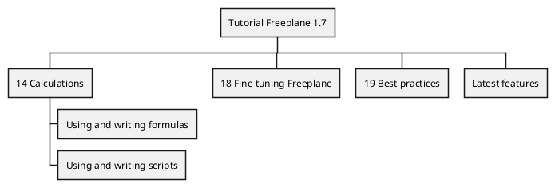
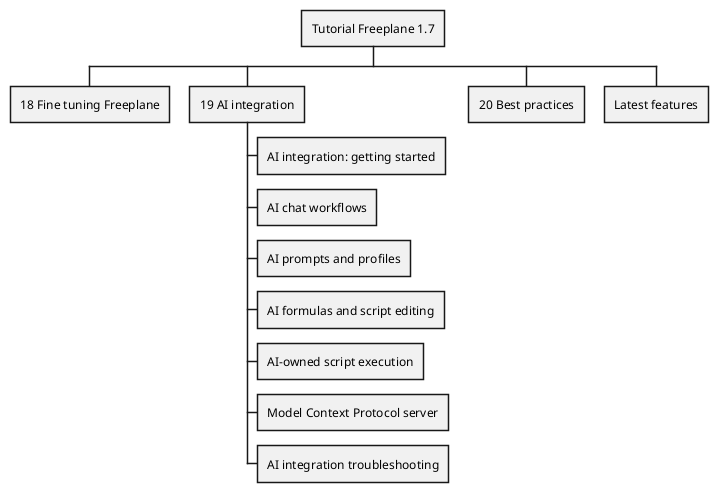

# Task: Add AI documentation to Freeplane user guide mind map
- **Task Identifier:** 2026-06-07-ai-user-guide-mind-map
- **Scope:** Plan and later add an AI documentation branch to
  `/Users/dimitry/git-repo/freeplane/freeplane/freeplane/doc/freeplaneUserGuide.mm`,
  based on the recently added AI docs pages in this repo, using
  Freeplane MCP as the only write path.
- **Motivation:** The docs site now has dedicated AI documentation,
  but the Freeplane user-guide mind map still has no AI entry point
  and only minimal formulas/scripts notes.
- **Constraints:**
  - Research may use both direct `.mm` inspection and Freeplane MCP
    reads.
  - Writing must use one path only. Use Freeplane MCP or Freeplane API
    calls through MCP. Do not hand-edit the XML.
  - Keep additions aligned with existing map conventions for styles,
    folding, details, links, and image handling.
  - Prefer a text-first increment. Add screenshots only if needed after
    confirming asset paths and detail-visibility handling.
  - Delay any operation that would require Freeplane scripting. This
    increment should use structured MCP node creation/editing only,
    even if that leaves numbering or hidden-details adjustments for a
    later follow-up.
  - Formatting governed by styles should not be repeated at node
    level. Prefer assigning styles and leaving node-level formatting
    unset unless a property is intentionally unique to that node.
  - MCP structured node tools do not expose per-property formatting
    provenance, so style-vs-local formatting cannot be audited live
    through those tools.
  - For rich text, do not apply HTML formatting at whole-body level.
    Use HTML mainly for structure and element-level inline emphasis.
    The supported baseline is HTML 3.2, with additional support for
    `span` elements with `style`.
- **Briefing:** The current docs source is in
  `/Users/dimitry/git-repo/freeplane/docs`. The implementation target
  map is in the sibling source repo at
  `/Users/dimitry/git-repo/freeplane/freeplane/freeplane/doc/freeplaneUserGuide.mm`.
  Recent AI docs content to reuse or condense lives mainly under
  `src/docs/ai/` in this repo, with one related scripting page at
  `src/docs/scripting/Asking_AI_from_scripts.md`. Detailed structure
  and editing notes for the map are recorded in
  `freeplane-user-guide-mind-map-notes.md` at this repo root.
- **Research:**
  - Done tasks `001-document-freeplane-ai-integration.md` and
    `002-document-ai-prompts-profiles-editors-formulas-scripts-and-mcp.md`
    added or updated these AI docs areas in this repo:
    - `src/docs/ai/ai-integration-getting-started.md`
    - `src/docs/ai/ai-chat-workflows.md`
    - `src/docs/ai/ai-prompts-and-profiles.md`
    - `src/docs/ai/ai-formulas-and-script-editing.md`
    - `src/docs/ai/ai-owned-script-execution.md`
    - `src/docs/ai/model-context-protocol-server.md`
    - `src/docs/ai/ai-integration-troubleshooting.md`
    - `src/docs/scripting/Asking_AI_from_scripts.md`
  - Freeplane MCP inspection of the currently open map confirmed that
    the selected root is `Tutorial Freeplane 1.7`, matching the target
    `freeplaneUserGuide.mm` file.
  - Direct XML inspection of `freeplaneUserGuide.mm` found 1,466 nodes
    and 20 top-level branches. There is no existing AI branch.
  - The current top-level chapters are:
    - `1 Introduction`
    - `2 Core map`
    - `3 Selecting and moving nodes`
    - `4 Relating and grouping nodes`
    - `5 Hyperlinking`
    - `6 Bookmarks`
    - `7 Formatting & styling`
    - `8 Filtering & finding nodes`
    - `9 Presenting`
    - `10 Publishing & sharing`
    - `11 Node extensions`
    - `12 Notes of nodes`
    - `13 Node tags`
    - `14 Calculations`
    - `15 Date & time actions`
    - `16 Protecting map or nodes`
    - `17 Code Explorer (JVM only)`
    - `18 Fine tuning Freeplane`
    - `19 Best practices`
    - `Latest features` (empty placeholder)
  - Relevant current AI-adjacent coverage is limited to `14
    Calculations`, which currently contains only these AI-related entry
    points:
    - `Using and writing formulas`
    - `Using and writing scripts`
    Both are brief and mostly point to external wiki material.
  - Content conventions in the current map:
    - 116 content nodes use `DETAILS`.
    - 62 details blocks are hidden.
    - `NOTE` content is not used in this map.
    - 33 details blocks contain HTML `` screenshots.
    - 5 nodes use `ExternalObject` hooks for images.
    - Many short explanatory leaves keep all content in node core text.
  - Style and structure conventions from map styles and `19 Best
    practices / The making of this mind map`:
    - top-level chapter nodes use `Introduction`, `Beginner`,
      `Advanced`, or `Professional` styles;
    - top-level chapters are folded and numbered;
    - `TitlesContent` is used for supporting content below a title,
      typically with a hidden edge;
    - `Purpose`, `Actions`, `Notes and explanations`, and `Tips and
      tricks` are reusable teaching styles.
  - Representative MCP content reads confirmed that normal explanatory
    blocks are stored as HTML details and that screenshot nodes usually
    store images as HTML like `` inside details.
  - No AI-specific image assets currently exist under
    `/Users/dimitry/git-repo/freeplane/freeplane/freeplane/doc/Images`.
  - MCP structured node-editing coverage fits most authoring needs:
    - create/edit tools can set text, HTML details, icons, styles,
      hyperlinks, and folding state;
    - the structured tools do not expose top-level numbering or hidden
      details directly;
    - the structured tools also do not expose per-property formatting
      values or style-vs-local provenance;
    - the Freeplane script API does expose deeper node properties, but
      this increment defers scripting.
  - User clarification for rich text in this map:
    - do not apply HTML formatting at whole-body level;
    - use HTML 3.2-compatible structure and element-level formatting;
    - inline emphasis or color may be applied to specific elements or
      words;
    - `span` elements with `style` are additionally supported.

- **Analysis:**
  - Use Freeplane MCP as the single write path because it preserves
    Freeplane semantics, matches the user's requested editing route,
    and avoids brittle raw-XML edits.
  - Add a dedicated top-level AI chapter instead of scattering all new
    material across existing branches because the docs site now has a
    standalone AI section and the map currently has no AI entry point.
  - Keep the new AI branch summary-level, with concise in-map guidance
    plus links or cross-links, because this map usually summarizes
    features rather than duplicating entire manual pages.
  - Update the existing formulas/scripts nodes only with small AI
    cross-references, because deep scripting coverage would exceed the
    current abstraction level of that branch.
  - Keep the first increment text-only. Defer screenshots unless later
    review shows they are necessary.
  - The user asked to delay operations that would require Freeplane
    scripting, so this increment should leave chapter numbering or
    hidden-details adjustments for later if the structured node tools
    cannot express them.
- **Design:**
  - Add a new folded top-level chapter under the root, styled
    `Professional`, placed after `18 Fine tuning Freeplane` and before
    `Best practices`, titled `AI integration`.
  - Use MCP structured node creation for the branch content. Do not
    use Freeplane scripting in this increment. If top-level numbering
    or other node properties are not exposed by the structured tools,
    defer those adjustments.
  - Keep formatting style-driven. Set only the main styles needed for
    chapter and summary-node roles, and avoid node-level width, color,
    border, edge, or other formatting overrides in this increment.
  - Keep generated HTML minimal and unstyled at body level. Use tags
    like `p`, `ul`, and `li` for structure, and use inline formatting
    only where specific words or elements need emphasis.
  - Under `AI integration`, create one second-level node per current AI
    docs page:
    - `AI integration: getting started`
    - `AI chat workflows`
    - `AI prompts and profiles`
    - `AI formulas and script editing`
    - `AI-owned script execution`
    - `Model Context Protocol server`
    - `AI integration troubleshooting`
  - Keep each second-level node folded by default and use one of these
    content patterns:
    - short overview in HTML details on the section node; or
    - a `TitlesContent` child for a one-paragraph summary, followed by
      focused child nodes for workflows, controls, or failure modes.
  - Mirror the existing docs pages at summary level, not as a full
    transcription. Preserve the page titles so future updates can be
    traced back to `src/docs/ai/*.md`.
  - Use internal node links where the new AI branch should point back
    to related in-map content. Use external links only where the map
    already follows that pattern or where the published docs page is
    the intended long-form reference.
  - Update `14 Calculations / Using and writing formulas` with a brief
    child that points to the new `AI formulas and script editing`
    section.
  - Update `14 Calculations / Using and writing scripts` with a brief
    child covering AI-owned scripts and scripts asking AI at summary
    level, pointing to the new AI chapter and, if needed, the published
    scripting docs.

- **Test specification:**
  - Automated tests:
    - N/A.
  - Manual tests:
    - Open or refresh `freeplaneUserGuide.mm` in Freeplane and verify
      the new AI chapter appears before `Best practices` in the intended
      root position.
    - Verify the chapter is folded and styled consistently with nearby
      `Professional` chapters.
    - Verify the chapter numbering is correct after user-side map
      adjustments, without requiring Freeplane scripting in this
      increment.
    - Verify each AI section node opens, its details text renders
      correctly, and any hyperlinks resolve to the intended internal
      node or external page.
    - Verify the two `14 Calculations` cross-references exist and point
      to the intended AI material.
    - Save the map and inspect the resulting diff in
      `freeplaneUserGuide.mm` to confirm that only the intended branch
      and any deliberate asset references changed.
    - If screenshots are later added, verify the referenced files exist
      under `.../doc/Images` and render inside Freeplane without
      requiring raw XML editing.
- **Implementation notes:**
  - **Interpretations:**
    - Treated the approved increment as MCP-only content work and
      deferred any scripting-dependent numbering or hidden-details
      adjustments.
  - **Tradeoffs:**
    - Used visible `TitlesContent` summary nodes instead of hidden
      details so the new AI branch stays readable without relying on
      scripting-only detail-hiding controls.
    - Kept formatting style-driven and HTML minimal because structured
      MCP tools do not expose formatting provenance well enough to
      justify local formatting overrides.
