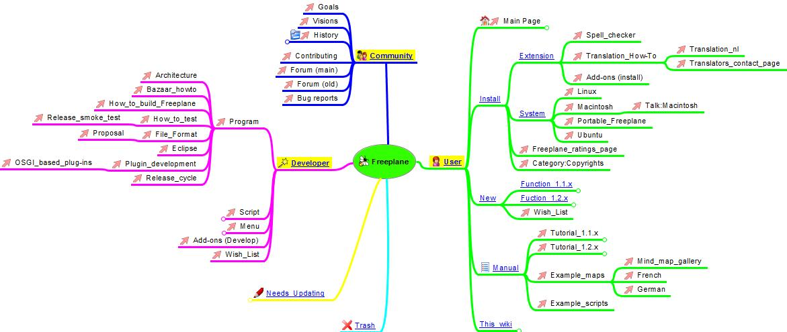
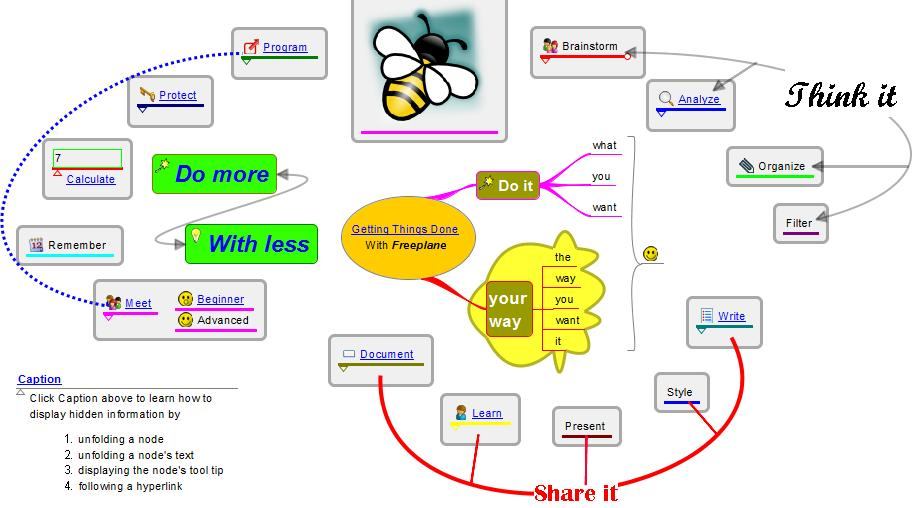
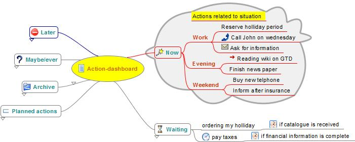
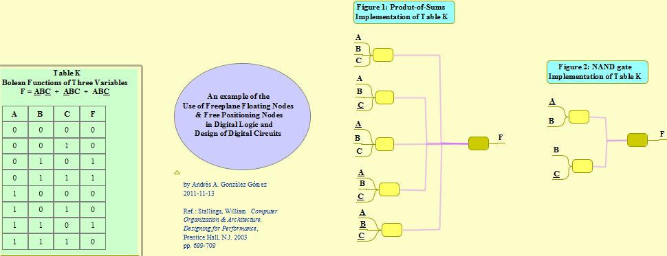
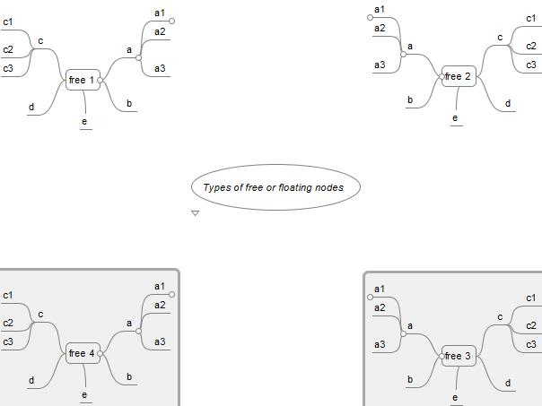

If you are not English: see [Translated wiki pages](Category:Translation.md) if this tutorial has been translated into your language.

<big>**This tutorial refers to Freeplane 1.2, which was released on October 20, 2012.**</big>
  

# Introduction
This Freeplane Tutorial Extensions describes a Tutorial with basic terms and how to use the basic Freeplane functions. In addition it contains examples of use cases and concrete instructions how to make these cases. The Tutorial is divided into parts for the *Beginner*, *Advanced user* and *Professional user*. The examples below are labelled in a similar way helping to indicate the level of difficulty if you want to make a map yourself. It is no problem if the beginner wants to navigate a map for the advanced or professional user.

# Download example map
You may view the examples without having Freeplane installed. So it is not necessary to download the example. It is possible to download the example once you have opened an example.mm as follows. In the browser you see the address of the opened map, e.g. *www.freeplane.org/mapsOnline/?map=example.map*. Now remove the part "?map=" (e.g. *www.freeplane.org/mapsOnline/example.map*) and press the Enter key to start the download.

# Instructional examples of Freeplane maps
## What is mind mapping

Mind mapping is a technique for collecting, developing and sharing ideas (like the plot of a story or threads of a new idea) in a visual map.  Developing a mind map helps to structure information in a visual way. It follows the random way in which the mind generates thoughts rather than following a linear format such as text in a Word document. You can plan a project, summarise your notes for an exam, brainstorm a new idea, take a brief. The uses are endless. 

The mind map on the right shows you some of the processes involved. 

The advantage of electronic mind maps over paper mind maps is that you can have as many nodes and branches as you like and can minimise them so as not to have a lot of clutter on your screen. There's no limit to the amount of information you can put in a mind map. You can also link to documents and web pages, delete unneeded nodes and branches and do lots of editing which is more limited with paper mind maps.

The advantages of Freeplane are presented in the mind map, as hidden information. Click the link below the picture to open the map. Then click the topic help *Navigation* for learning how to unhide hidden information.   

## Brainstorming with digital post-its
Generally brainstorming starts with writing ideas on post-its and sticking them to the wall. Freeplane has a "free node" for this: if you Ctrl + double click on a free place of the mind map, a node opens. When  you start typing you will see your text in this free node. Note: This feature doesn't work on Mac yet. If you're done, you can do the same with a different idea in a different place. Once you're ready, you can move similar ideas closer together and connect them in a hierarchy by dragging and dropping. See [[#Floating_nodes|Floating nodes]] for more examples.

## Map as index

**Beginner.** One way to bring structure to linear text is to use categories as we have in this wiki. A limitation of these categories however is that hierarchical relations cannot be displayed in a simple way. A mind map is better suited for this, as is shown by the example map on the right.

In this particular case the categories of the wiki are represented as underlined hyperlinks. The pages of the wiki are represented by red-arrow hyperlinks. The latter are created simply by dragging the page address (URL) of a wiki page onto a node and then editing the title of the node. If you clik on the hyperlink under the image, the mind map opens and you can click the links to jump to the pages of the wiki.

**Advanced.** An index can have many different forms. The map on the right displays all Freeplane functions. These functions are described in more detail in two maps called *Tutorial* and *Documentation* respectively. The map contains two solutions for linking a function to the two descriptive maps. The functions on the left half have the two hyperlinks themselves, but they are hidden until the  mouse cursor is hovering over the function (tool tip). The functions on the right half of the map have an external pointer - the nodes with the question mark. These external pointers contain the hyperlinks, which again are hidden until you hover with the cursor over the question mark.

**Professional.** The map on the right is an index map for the use of cases mentioned in this tutorial. Unlike a classical linear index the indexed items in the mind map can be displayed in any order as can the relationships between them. This map uses most of the functionalities of Freeplane in one map.
Click the link under the image to open the mind map.  Then read the node called *Caption* to learn how to navigate the map and unhide hidden information.

## Meeting support

Freeplane is very suited for rapid and easy [note taking](https://secure.wikimedia.org/wikipedia/en/wiki/Notetaking) during meetings. In fact Freeplane can support the whole meeting process. This process starts with designing and distributing the topics of the agenda, keeping the attendants list, adding notes to the topics of the agenda and finally producing the decisions and action list of the meeting. Actions can also be supported with time signals. It is even possible to include the incoming and outgoing information in the map, either as hyperlinks or in a special area (Notes). And last but not least, part or all of the information can be password protected.

The maps for the beginner and advanced user display the same meeting information, but differently "formatted", with the different components available in Freeplane (node core versus node details, attributes, images, styles, etc.). Click on the hyperlinks below the images to open and navigate the respective maps. In *Meeting advanced*: hover the nodes (texts) to see hidden text like notes.

Instructions (animation) on how to make and use the beginner meeting support are available [**here**](http://www.kioo.nl/freeplane/CoreMeeting). When the example is stripped from its specific information, the remaining structure could be used as a template for meetings in general.

## Organize your collection
[[File:CollectionBeginner.jpg|left|[Collection - Beginner](http://www.freeplane.org/mapsOnline/?map=CollectionBeginner.mm) ]]

With Freeplane you can order, index and describe your collections, whether images, audio files or any other kind of information. It's especially easy to select a group of files and copy them in one action to a mind map. In that case these files appear as clickable arrows (hyperlinks) in separate nodes, as shown in the mind map on the left (*Beginner collection*). Once in the mind map, you can rename and sort the nodes. For image links, you can turn the links to images which are visible in the map. 

Of course it's possible to build a collection item by item too. And it is possible to add additional information and format it any way you want, as in the mind map on the right (*Advanced collection*). If you hover over the names, you will see additional information about location and time, which appear in a table of attributes. Or you can click the name of an image, which makes the image appear or disappear (fold).

If you have collections of different kinds in one map, consider using a different style or a different icon for each kind. In that way you can use filtering to create a view of all elements of the same kind.

## Vault for information

If you would like to keep certain information private, you can password protect it. It's possible to protect the whole map or just protect a (sub)tree of nodes. The example on the right contains a protected map "MyVault". Within this protected map are branches for finance and for websites. These are separately protected. 

Open the map by clicking *My Vault* under the picture. Then find the unlock icon in the menubar and click it. Enter the password "MyVault". Now the map opens (unfolds) and you see the branches for websites and for finance. Select creditcard of one of the banks, click the unlock menu button and enter password "creditcard". Now the creditcard information unfolds. You can do the same with the other creditcard. Then go to the websites and select the Freeplane open forum, click the unlock button and enter "Freeplane" as a password. Now the information for login unfolds. Note that an explanation of each node is presented below each node titel.

## Dashboard for GTD

When *Freeplane* opens it starts with a standard map. This map can be modelled into a dashboard with direct access to the most important information at home and on the Internet. You can do this by simply dragging hyperlinks into your map. Besides you can add (hidden) content to hyperlinks to remember their meaning. Alo you can set signals to remember when you have to give attention to this information. This makes Freeplane particularly supportive for [Getting Things Done](http://nl.wikipedia.org/wiki/Getting_Things_Done). To view and navigate the map, click on the link below the image.

For advanced features for helping to get your Getting Things Done system work more flawlessly, you can try to use the [Freeplane|GTD+](http://www.freeplane.org/wiki/index.php/Add-ons_(install)#Freeplane.7CGTD.2B) plugin. There is a template designed to help you get started with the plugin available [here](https://www.itworks.hu/index.php/template-to-get-you-started-with-freeplane-gtd/)

## SWOT analysis

Mind maps are a fantastic tool for carrying out all kinds of analyses. In this, Freeplane suports using images and arrows with labels to display concepts, which helps to keep oversight and focus. In case this is not enough, Freeplane supports using hidden text which the user can roll down or hover over. Click on the small triangles, or hover the cursor over the images to see a descriptive text. To view and navigate the map, click on the link below the image.
   

## Assignment & Presentation

A map can be used as a student assignment, and can include directions, set questions and give links to literature. The student can click the literature links to open the literature and add answers to the questions - in the map itself. 
 
The map to the left contains a map with keywords for questions and literature links. For the advanced student these could be removed. Once the assigment is completed and the result is entered in the map, the map could be used to learn and do the presentation.
The map to the right contains model answers to the questions which could be used to check the result. Answers could be password-protected so that students can only see them once given the password. To view and navigate a map, click on the link below the image.
<To DO: translate the maps in English>

## Tutorial

 
Freeplane's Tutorial is an example of how a Freeplane map can be used to hold extensive amounts of (hidden) information and for delivering it in a user determined way, adapted to the user's experience level. 

In Freeplane the node hierarchy of parent-child-grandchild nodes is by default displayed in left-right direction. Hierarchical levels can be used to display a chapter - (sub)subchapter - content chain. To be visible, the chain needs to be horizontally scrolled. Freeplane helps to do this by automatically scrolling to make the node where the cursor is fully visible. Yet the classic book-view with titles and content oriented in a top down direction may be advantageous in situations where you gradually unfold the text and want to easily read back and forward. 

On the left and right side are two example maps which at first glance may appear very similar, yet are very different if you start using them.

* In the map on the right the content node has been moved below its parent sub chapter (= title) node. The title-nodes have Node style *combined*. As a result, when the title node is folded (child with content is hidden) it has a bubble and when it is unfolded the bubble disappears. When more sub chapters are unfolded, this gives a structured page like appearance with content separated by chapter headers which can be easily read back and forth - without horizontal scrolling. On the other hand, the user has maximum overview if he folds most of the nodes.

* In the map on the left the two nodes for title  and content are combined in one node: title and content are displayed in the Core and Details fields respectively. This has the advantage that node core can be styled with a colour, bubble, icon etc. to make the title stand out. And the text in Details can be formatted as a paragraph in a word processor. The result is an appearance which is very similar to a named paragraph of a book. The details field could be hidden and displayed in a tool tip, which is equivalent for the folding discussed above. 

If the two maps are compared one can conclude that the view of the left map is relatively static. The view of the right map is more flexible. If in the right map you select a chapter (e.g. chapter 2) and then in the menu bar click the icon "Unfolds all selected nodes and their children", all text becomes visible as in the view of the left map. In many cases this is not what you want and then you could select a sub chapter and only unfold all text of this subchapter. From these examples it is clear that it is possible to implement book-like view in different ways, with different characteristics.

When implementing a map with tutorial information it is a choice if and when the hierarchical relations should be as prominently left-right oriented as possible or if, for practical reasons or taste, children with content could be shown below parents with titles (right hand map); or alternatively if the mechanism with core-details (and hiding) are used (left hand map).

*Note that when viewing the reference through the Internet the look and feel is less and some features are not available (e.g. the predefined filters and the Freeplane menu's). If you use the reference from the Help, the look and feel is optimal, but the options are restricted to read only. Only if you load the reference as a .mm file in Freeplane, alle functionality is present.*

# Information management
Freeplane can support organizing, managing and accessing information. With the add-on IndexFile you can turn a clasic file system into a flexible system for information sharing and working on dossiers in teams.  Read [**more ...**](Information_management_with_add-on_IndexFile.md)

# Docear Academic literature suite
[**Docear**](http://docear.org) supports in doing all the tasks related to literature management:

* Finding new literature (searching and exploring)
* Organizing literature (reading, annotating, and retrieving)
* Creating your own literature (drafting, writing, referencing, and publishing) 
Docear is going to be inegrated with Freeplane at the end of 2011.

# Special

## Floating nodes
Floating nodes come in sorts. The most easy to use is the free (posional) floating node which is created by *ctrl+double clicking* a free area of the map. It is handy like a post-it to gather unstructered ideas in a brain storm. They differ from the post-it because it is possible to start an independent hierachy of nodes within the *cloud* of the post-it node. These post-it nodes can be susequently connected to the hierarchical nodes by dragging and dropping it on the node of your choice: it will become a child node of this node.  Below you see other types of free nodes as well. The formatting of a floating node is determined by the system style *Floating node*. This standard style can be edited to hide the cloud, to show the edges of children, color and more.   
**General examples** 

[Multiple sorts of floating central nodes](/attic/Freeplane_map_with_multiple_sorts_of_floating_central_nodes.mm ':ignore')

* Multiple sorts of floating nodes
* Floating nodes in digital logic
* [Free nodes in *Index applications*](http://www.kioo.nl/freeplane/TasksWithFreeplane)

    

 

**Free positioned versus floating nodes** 
[Behaviour of free or floating nodes](/attic/TypesOfFreeOrFloatingNodes.mm ':ignore') 

There are several ways to make independent or semi-independent groups. The group free 1 consists of a free positionable node with free posistionable children and regular grand childern.
To make the group called free 1:

* define a free positionable parent node (free 1).
* define its children.
* select all children, next choose Edit > Free positionable node; (this makes appear all nodes in a pile, on top of each other)
* set the childrens edges to visible  (do it a once, keep the selection; it may be handy to define a style for this)
* drag each child from the pile to its wanted position
* define the children’s children – if you want them

Open the mind map on the right and read the text hidden in the root node for peculiarities of the groups free2, free 3 an free 4. For example, group free 2 is a copy of free 1, but is not the same...

## Calculations with formula plug in

.jpg)
[Iron_Sulfate_Production_-_Calculations_with_Formula_plugin_(AAGG_-_andressf).mm](/attic/Iron_Sulfate_Production_-_Calculations_with_Formula_plugin_(AAGG_-_andressf).mm ':ignore')

[Iron Sulfate Production-AAGG](/attic/Iron_Sulfate_Production-AAGG_-_andressf-.mm ':ignore')

     

## Conditional styles
[Example concept map](/attic/Example_-_ConceptMap.mm ':ignore')

      

## Summary nodes

      

## Writing with Freeplane

_-_Writing_an_essay_with_Freeplane.jpg)

[Novel Writer's Notebook: A sample map for writers](/attic/NovelWritersNotebook.mm ':ignore')

See node *The making of this documentation* in Freeplane's *Help > Documentation* for an example how to create a documentation mind map. See also *Floating nodes* above.
       

## Developing a video script with Freeplane

 
http://www.freeplane.org/mapsOnline/?map=WhyFreeplane.mm

Developing a script for a film or video is a creative process in which the ordering and content of the image and audio parts are changed continuously. The mind map on the right side is being used to develop the introduction video *WHY Freeplane*. The left side of the map contains the structure underlying the video. At a certain level each structural part ends in a narrative and a series of actions on the screen. The narratives have been given style Narrative. You can use filtering for “style” equal to “Narrative” and with condition "do not show ancestors" to see all narratives in a linear chain. If you unfold a narrative you see a sub tree of actions taking place on the screen during the narrative. Because filtering is not possible on-line, see [here](http://www.freeplane.org/mapsOnline/WhyFreeplane.pdf) for the filtered list of narratives.
   

## Problem solving using Freeplane
For the concepts of tool maps and work maps see page [Freeplane and problem solving](Freeplane_and_problem_solving.md).

## Publishing multiple maps in one Java applet
Freeplane lets you export a map for publishing it on Internet or Intranet. If you have multiple maps to publish and maintain, it is more economic to use the procedure described ***here***. The maps in [Freeplane Tutorial Extensions](Freeplane_Tutorial_Extensions.md) are published in this way.

## Other

* [Fishbone_&_Tree_Diagrams_in_Freeplane](/attic/Fishbone_&_Tree_Diagrams_in_Freeplane.mm ':ignore')

* [Comparison between Freeplane 1.1.2 and Freeplane 1.2.1 alpha](/attic/Comparison_FP2_1vsFP1_2.mm ':ignore') (Must be updated)

# Animations

The following are some examples of animations. They were made in Dutch for FP 1.1.3 and need to be adapted to 1.2 and translated in English.

* [**Instruction for viewing maps in Freeplane**](http://www.kioo.nl/freeplane/tutorial_en/navigation).
* [**Demonstration of Details, notes, attributes and filtering**](http://www.kioo.nl/gwr/gwr.htm).
* [**Making your first map**](http://www.kioo.nl/freeplane/FreeplaneInstructie/Basisinstructie-knoopbehandeling.htm).
* [Video illustration possibilities moving nodes](https://www.youtube.com/watch?v=0xkUzsd4naA) N.B. The possibilities of free floating nodes are not shown.
* [Video's and animations How-to](Videos_and_animations_How-to.md) for Freeplane

# User forum
[Open forum Freeplane](https://www.freeplane.org/forum2012/viewforum.php?f=1) for questions and discussions.

# Links

Some free icons
* [Silk Icons](http://www.famfamfam.com/lab/icons/silk/) organized into folders [http://www.mediafire.com/file/dy4ynmkvmhz/Silk icons organized.zip](http://www.mediafire.com/file/dy4ynmkvmhz/Silk_icons_organized.zip.md) 
* [Flags of the world](http://www.famfamfam.com/lab/icons/flags/) icons organized into folders [http://www.mediafire.com/file/nomjzj3wmyw/Country Flags organized.zip](http://www.mediafire.com/file/nomjzj3wmyw/Country_Flags_organized.zip.md)

Some very simple scripting examples

* [Dialog in script](https://sourceforge.net/projects/freeplane/forums/forum/758437/topic/4542178)
* [Caret position](http://www.freeplane.org/wiki/index.php/Scripting!_Example_scripts#Transpose_the_two_characters_around_the_cursor_.28for_bad_typists.29)

Other
* [Examples of cv-maps](http://jobmob.co.il/blog/cv-mind-map-examples/)

<!-- ({Category:Documentation}) ({Category:Example_maps}) -->

