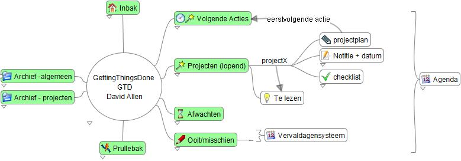
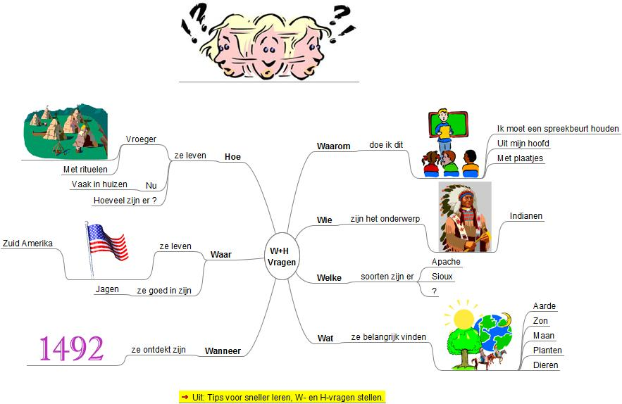

 
**Als gevolg van een cyber aanval zijn de voorbeelden op deze pagina niet in te zien.  Raadpleeg de Engelse voorbeelden...**
 

Deze Tutorial heeft betrekking op Freeplane 1.2.x. Je kunt Freeplane [**hier**](Main_Page.md) gratis downloaden.   
# Instructie Freeplane

## Wat is mindmappen
[<mm>[[:WhatIsMindMapping_nl.mm |applet|Wat is mindmappen](File:WhatIsMindMapping_nl.jpg.md) </mm>]]
Een mindmap (spreek uit: maintmep) is een kaart van informatie die is geordend in onderwerpen en deelonderwerpen rond een centraal thema. Op scholen wordt ook wel de term woordweb of woordspin gebruikt. De informatie kan de vorm hebben van teksten, plaatjes en/of verwijzingen naar multimedia en andere programma’s. Het proces van het maken van een mindmap kan helpen bij het uitvoeren van creatieve processen zoals analyseren, plannen en organiseren; en bij leren en onthouden. Een elektronische mindmap kun je gebruiken als persoonlijke werkomgeving en om het werken in je bedrijf of op school te ondersteunen: zie  [wikipedia](http://nl.wikipedia.org/wiki/Mindmap) en de voorbeelden op deze pagina.

Er zijn mensen die de voorkeur geven aan het maken van mindmaps op papier en mensen die de voorkeur geven aan het maken van mindmaps met de computer. In de mindmap hiernaast zijn de belangrijkste voor- en nadelen opgenomen in verborgen tekst. Open de mindmap door op de link onder het plaatje te klikken. Klik vervolgens op de Help bij *Navigeren* om te leren hoe je de verborgen tekst kunt tonen.

## Een mindmap op deze pagina bekijken
Door op een plaatje van een mindmap aan de rechterkant van deze pagina te klikken, kunt je het plaatje vergroten. Onder elk plaatje bevindt zich een snelkoppeling met de naam van de mindmap. Als je hier op klikt opent de mindmap in een presentatievenster en kunt je takken open/dichtvouwen en koppelingen (pijltjes) volgen door er op te klikken. Bij sommige takken verschijnt een onderliggende tekst als je de muiscursor boven de tekst van de tak (knoop) houdt. Je kunt ook de hele mindmap verplaatsen door op een lege plaats in de achtergrond te klikken en te slepen. Zie ook de [**instructievideo** ](http://www.freeplane.org/wiki/index.php/Mind_Map_Gallery/Dutch#Instructievideo.27s) voor beginners.  Je kunt de inhoud van de mindmap in deze gallerij niet wijzigen: daarvoor moet je een mindmap-programma gebruiken.

## Hoe maak ik een mindmap ?
Deze galerij bevat voorbeelden van mindmaps. Op de pagina [**Hoe maak ik een mindmap**](How_to_nl.md) is beschreven hoe je het gratis programma *Freeplane* kunt downloadenen en hoe je een mindmap kunt maken of aanpassen met dit programma. De software van Freeplane is voor iedereen vrij beschikbaar ("open source").  Het gebruik van Freeplane sluit daardoor aan bij het [overheidsbeleid (NOIV)](https://noiv.nl/over-noiv/). Voor het bekijken van de voorbeelden op deze pagina is het niet nodig om *Freeplane* op je computer te hebben: bij het openen van een mindmap op deze pagina wordt automatisch een freeplane-viewer geopend voor het bekijken van de mindmap. (Helaas worden de Nederlandse menubalken daarbij in het Engels weergegeven.)
  
 
**Handleiding Freeplane** 
Om inzicht te krijgen in de mogelijkheden van Freeplane kun je behalve de voorbeelden op deze pagina, ook de handleiding van Freepane bekijken.  Deze handleiding is opgenomen in een mindmap en dient zo zelf ook als een voorbeeld van wat je met een elektronische mindmap kunt doen.
  
Kik op de hyperlink onder het plaatje om de handleiding te openen. Klik vervolgens op de woorden en snelkoppelingen in de mindmap om te zien wat de mogelijkheden van *Freeplane* zijn.
  
N.B. Je kunt een mindmap met extentie .mm ook met het programma Freemind bewerken. Omdat Freemind minder functionaliteit bevat dan Freeplane, zal je dan niet alles zien. Omgekeerd kan een mindmap die met Freemind is gemaakt wel door Freeplane worden getoond.

## Inhoud van deze galerij
Deze galerij bevat Nederlandstalige mindmaps die laten zien wat een elektronische mindmap is en waarvoor je deze kunt gebruiken. De gallerij bevat tevens mindmaps en ideeën voor mindmaps die je kunt aanpassen voor eigen gebruik. In de tekst is aangegeven als je de mindmap op je eigen computer kunt laden (download) voor gebruik met het programma *Freeplane* of een ander mindmap-programma dat .mm bestanden kan lezen.
 

# Mindmap als persoonlijke omgeving

*Freeplane* start op met een standaard mindmap. Van deze mindmap kun je een persoonlijke werkomgeving maken met directe toegang tot je belangrijkste informatie op Internet en je bedrijfsomgeving. Snelkoppelingen naar pagina's, bestanden en applicaties kunnen eenvoudig met plakken en knippen (drag and drop) aan de mindmap worden toegevoegd. Verder kun je op elk punt eenvoudig notities en signaleringen toevoegen. Hiermee is Freeplane uitermate geschikt om [actielijsten](http://nl.wikipedia.org/wiki/Getting_Things_Done) te maken en onderhouden. Verder is Freeplane te gebruiken als een dashboard waarmee je toegang tot al je documenten en applicaties hebt. Als je je mindmaps en andere documenten bijvoorbeeld met [dropbox](http://www.dropbox.com/)  bewaart, kun je hier vanaf elke computer bij.

### Digitale kluis

Als je informatie hebt die anderen niet mogen kennen dan kun je deze informatie met een wachtwoord beschermen. Het is mogelijk een hele mindamp te beveiligen of alleen een (deel)tak met knopen. In het voorbeeld hiernaast is de hele mindmap met een wachtwoord beschermd. De mindmap heeft twee hoofdtakken voor repectievelijk geldzaken en websites. Deze zijn elk apart nogmaals beschermd. 

Open the mindmap door op *Mijn kluis* onder het plaatje te klikken. Zoek dan het pictogram het slotje in de balken bovenin het scherm en klik hierop. Er verschijnt dan een venster waarin je een wachtwoord moet typen. Type MyVault. De mindmap opent nu en laat de takken voor geldzaken en websites zien. Selecteer van een van de banken de knoop "creditcard". Klik op het slotje en vul als wachtwoord opnieuw creditard in. Er open nu een knoop met de gegevens van de creditcard. Hetzelfde kun je doen met de andere bank. Ga nu naar de kant van de websites. Kies  Freeplane open forum, klik op het slotje en voer als wachtwoord "Freeplane" in. Nu wordt de inlog informatie van de website zichtbaar. 

## Contacten

Er zijn verschillende manieren om adreslijsten e.d. in een mindmap te vatten. De linker kant van de mindmap toont contactgegevens welke in de attributen van een knoop zijn vastgelegd. De rechterkant van de mindmap toont contactgegevens die in zogenaamde kindknopen zijn vastgelegd. De vorm van de takken is in dit geval rechthoekig gekozen.
    

# Mindmap op het werk
## Freeplane als hulp bij vergaderen

Een van de dingen waarvoor Freeplane vaak wordt gebruikt is het maken van aantekeningen tijdens vergaderen. Freeplane kan zelfs het hele vergaderproces ondersteunen. De ondersteuning begint bij het het opstellen en verspreiden van de agenda, het bijhouden van de deelnemerslijst, het toevoegen van aantekeningen bij de agendapunten en eindigt met het vastleggen van de notulen met besluiten en acties. Daarbij kan Freeplane elke actie een herinnering koppelen zodat deze niet wordt vergeten. Ook is het mogelijk informatie die nodig is tijdens de vergadering via de mindmap te ontsluiten. En niet in de laatste plaats kan gevoelige informatie met een wachtwoord worden afgeschermd.

De boven besproken handleiding maakt onderscheid tussen drie ervaringsniveaus: Beginner, Ervaren en Professional. De twee figuren hiernaast tonen dezelfde informatie, maar dan opgemaakt door een beginnende en een ervaren Freeplane gebruiker. Als je beide mindmaps bekijkt dan zie je dat de mindmap van de ervaren gebruiker een betere ondersteuning biedt. Van belang is verder dat als je de speciefieke informatie van de behandelde vergadering weg haalt, een generiek vergadersjabloon over blijft dat ook voor andere vergaderingen kan worden gebruikt.

Klik op de hyperlinks onder de plaatjes om de beide mindmaps te openenen. In *Vergadering geavanceerd*: zweef met de cursor over de teksten om de verborgen teksten te zien. Je kunt [**hier**](http://www.kioo.nl/freeplane/CoreMeeting) een animatie zien hoe deze mindmap is gemaakt.

Als je precies wilt weten hoe notuleren met een mindmap in zijn werk gaat, lees dan  [*Notuleren en mindmappen, een perfecte comninatie*](http://www.taaltek.nl/mindmappen_okt_2008.pdf) van Marjolein de Jong. Zij maakt een aparte mindmap voor elk agendapunt, hetgeen bij een mindmap op papier is aan te raden. Bij een elektronische mindmap kunnen alle agendapunten binnen één mindmap worden opgenomen, zoals in het voorbeeld hiernaast, omdat de agendapunten desgewenst kunnen worden verborgen (dichtgevouwen) of getoond (opengevouwen). 
  

## Dingen gedaan krijgen (GTD: Getting Things Done)

David Allen heeft een methodiek beschreven om efficienter en relaxter te kunnen werken. Deze methodiek wordt wereldwijd door vele kenniswerkers gebruikt. De methodiek is samengevat in nevenstaande mindmap. De mindmap kan daarbij worden gebruikt als ondersteuningsmiddel om activitiviteiten en gegevens te beschrijven.

## Mindmap als hulp bij plannen
Een mindmap kan worden gebruikt om acties te plannen. Hoe de mindmap er uit moet zien is afhankelijk van de situatie. Soms heb je genoeg aan een actielijst met per actie een naam en een aanduiding van de prioriteit (mindmap links; klik op het plaatje om dit te vergroten). Soms wil je ook de datum gereed en een actiehouder tonen (mindmap midden). En soms is het handig om ook een beschrijving of toelichting van de actie te kunnen tonen (mindmap rechts). Freeplane combineert deze drie mogelijkheden in één en dezelfde mindmap. Ook is het mogelijk een moment in te stellen waarop je herinnert wilt worden dat actie nodig is (aqenda). En natuurlijk kan aan elke actie (taak) een boom van deelacties worden gekoppeld. Er ontstaat zo een logisch stroomschema van gerelateerde acties. Met verbindingslijnen kunnen relaties tussen acties in verschillende stromen worden aangegeven.
  
Open de mindmap *Actielijst* door op de hyperlink onder een van de plaatjes te klikken. Klik in de bovenste actie (knoop) op het pijltje omhoog (driehoekje) om de toelichting (= bijlagetekst) te verbergen. Houd de cursor boven de tekst van de derde actie om de verborgen toelichting, actiehouder en datum gereed te zien. (Actiehouder en datum-gereed zijn opgenomen als attributen.) Houd de cursor boven de tweede actie om de brief te zien die Jan Janse heeft gestuurd en waarop een antwoord wordt gevraagd (= notitietekst). De agendafunctie is alleen beschikbaar als de mindmap met Freeplane op de eigen computer wordt uitgevoerd. 
[[File:Taakverdeling3.jpg|left|[Actielijst](http://www.kioo.nl/freeplane/taakverdeling) ]]
[[File:Taakverdeling1.jpg|left|[Actielijst](http://www.kioo.nl/freeplane/taakverdeling) ]]
[[File:Taakverdeling2.jpg|left|[Actielijst](http://www.kioo.nl/freeplane/taakverdeling) ]]

             

## Mindmap bij samenwerken (teamrollen van Belbin)

Samenwerken binnen organisaties is niet altijd even gemakkelijk. Op basis van onderzoek onderscheidt [**Belbin**](http://nl.wikipedia.org/wiki/Meredith_Belbin) 9 teamrollen. In de juiste verhouding en combinatie kunnen deze rollen elkaar versterken en bijdragen aan het succes van projecten. In de verkeerde verhouding kunnen ze leiden tot het mislukken van projecten. Met een [test](http://www.thesis.nl/index.php?option=com_db8belbin&Itemid=43) kun je bepalen welke (drie) rollen je teamleden en jou het beste liggen. Vervolgens kun je in de mindmap hiernaast achter elke rol de namen van de personen plaatsen die geschikt zijn voor de betreffende rol. Hiermee maak je inzichtelijk en bespreekbaar in hoeverre het team voldoende gevarieerd en volledig is en welke rollen bijzondere aandacht vereisen. 
  
Open de mindmap door op de hyperlink onder het plaatje te klikken. Beweeg de cursor boven elke teamrol en er verschijnt een beschrijving van de rol; de tekst is overgenomen uit de wiki over Belbin. Klik op de pijltjes en er opent een relevante webpagina. Eén van de pijltjes opent een videofilmpje over de 9 rollen van Belbin op Youtube.

## Mindmap bij een SWOT-analyse
    [[File:SWOT.jpg|thumb| [http://www.kioo.nl/freeplane/swot  SWOT-analyse] ]]
Bij het analyseren van een organisatie of project wordt soms gebruik gemaakt van een SWOT-analyse, zie [Wikipedia](http://nl.wikipedia.org/wiki/Sterkte-zwakteanalyse). Een elektronische mindmap kan helpen om de *Sterkten, Zwakten, Kansen en Bedreigingen* te beschrijven en vervolgens te ordenen. De mindmap kan bovendien helpen om de betekenis van deze begrippen uit te leggen.
  
Klik onder het plaatje op de hyperlink SWOT-analyse om de mindmap te openen. Merk op dat (schaalbare) plaatjes zijn gebruikt om de begrippen *Sterkte, Zwakte, Kans en Bedreiging* te illustreren. Breng de cursor boven respectievelijk de tekst *Sterkte, Zwakte, Kans en Bedreiging* om te zien wat deze begrippen betekenen. Naast elk van deze begrippen wordt een voorbeeldinvulling getoond. Breng de cursor boven de basisknoop (SWOT) om verwijzingen naar literatuur te zien.

## Mindmap voor de samenhang van metagegevens

Informatie binnen een organisatie moet worden geordend, beschreven en beheerd om te zorgen dat dat deze kan fungeren als betrouwbaar en toegankelijk bedrijfsgeheugen. De mindmap rechts maakt zichtbaar dat de metagegevens die hiervoor nodig zijn uiteenvallen in een aantal groepen: elke groep is omgeven door een rechthoekig kader. Pijlen geven relaties tussen gegevens aan en labels bij de pijlen beschrijven de aard van de relatie. Op deze wijze kunnen bijvoorbeeld alle [metagegevens voor de rijksoverheid](http://www.e-overheid.nl/e-overheid-2.0/live/binaries/kennislab/pdf_bestanden/091210-toepassingsprofiel-metagegevens--v1-0-.pdf) worden beschreven.
  
Klik op de hyperlink onder het plaatje om de mindmap te openen. Beweeg met de cursor over de teksten om de verborgen toelichtende tekst te tonen. Selecteer de centrale knoop en klik vervolgens in de menubalk op de rode cirkel met het minteken om de hele mindmap dicht te vouwen: je ziet dat alleen de vijf groepen gegevens. Klik vervolgens op elke groep om deze één voor één open te vouwen.

## Mindmap voor informatiebeheerregels

Voor de [rijksoverheid](http://www.archief.nl/waardering-selectie/projecten/bewerking-archiefachterstanden-vanaf-1976/generiek-waarderi) is in het [Generiek waarderingsmodel rijksoverheid (GWR)](http://www.archief.nl/sites/default/files/generiek_waarderingsmodel_rijksoverheid_1.0.pdf) beschreven welke informatie blijvend (B) dan wel een bepaalde tijd (V + vernietigingstermijn in jaren) bewaard moet worden. De beschrijving bestaat uit een document en tabel van 26 pagina’s met hoofdprocessen en subprocessen; en voor elk van deze processen een beschrijving, toelichting, waardering (B/V) en voorbeelden.  Dit is veel en daardoor minder makkelijk te overzien en gebruiken. Dezelfde informatie wordt in de mindmap rechts gelaagd en modulair gepresenteerd. Met het zoek- en filtermechanisme van de mindmap heb je direct toegang tot alleen die informatie die je op een bepaald moment wilt zien.
  
Bekijk de [demonstratie](http://www.kioo.nl/gwr/gwr.htm). Open daarna de mindmap door op de hyperlink onder het plaatje te klikken. Beweeg de cursor over de teksten (hoofdprocessen) om de volledige beschrijving (categorie), toelichting en voorbeelden te zien. klik op een hoofdproces om deze open te vouwen zodat de subprocessen worden getoond. Beweeg de cursor over de subprocessen om de volledige beschrijving, toelichting, waardering en voorbeelden te zien. Vul in de zoek/filterbalk een term in om te zoeken/filteren zoals in de demonstratie.  Raadpleeg de handleiding om meer over zoeken en filteren te lezen.

## Mindmap voor informatiebeheer bij digitaal werken

Bij digitaal werken verandert er veel, zowel voor de gebruiker als de beheerder van informatie. Deze mindmap toont per proces van de gebruiker en de beheerder de belangrijkste veranderingen.
    

## Mindmap bij het oplossen van problemen
In het engelstalige artikel [**Freeplane and problem solving**](Freeplane_and_problem_solving.md) wordt een algemene methode beschreven om met gebruik van twee mindmaps een veelheid aan problemen op te lossen.

 

----

# Mindmap in de klas
Een mindmap kan worden gebruikt om op een flexibele en interactieve manier informatie voor een les aan te bieden.
Dezelfde mindmap kan daarbij door de leerling worden gebruikt om de antwoorden op de vragen die hij heeft gevonden vast te leggen, en eventueel te leren. Zie ook [TU Delft, sectie EduTec](http://www.digitaledidactiek.nl/wp/?p=527) en [Onderwijs van morgen](http://www.onderwijsvanmorgen.nl/mindmaps-in-het-onderwijs/).

## Sneller leren door vooraf vragen te stellen
Om sneller te leren helpt het om vooraf wat- en hoe-vragen te stellen en deze tijdens het leren te beantwoorden, zie [lereniseenmakkie.nl](http://www.lereniseenmakkie.nl/Maakwerk/Vragen_klaarzetten.html). Een mindmap kan dit proces handig ondersteunen. De mindmap is te **[downloaden](http://www.kioo.nl/download/?dfile=WH-Vragen.zip)**.
        

## Maken en geven spreekbeurt
[[File:SjabloonOctopus.jpg| left|  [Sjabloon spreekbeurt](http://www.kioo.nl/freeplane/Octopus/SjabloonOctopus.html) ]]

Een mindmap kan worden gebruikt om een opdracht voor een spreekbeurt te geven met aanwijzingen (hints) op welke vragen de leerling een antwoord kan of moet zoeken en met een begin van literatuur. 
De leerling kan de literatuurverwijzingen in de mindmap aanklikken en bestuderen en de antwoorden op de (eigen) vragen aan de mindmap toevoegen. Links is een voorbeeld mindmap met kernwoorden voor vragen en literatuurverwijzingen opgenomen. Voor de gevorderde leerling kan men de kernwoorden en/of de literatuur eventueel verwijderen.
Als de mindmap is ingevuld kan deze worden gebruikt om de spreekbeurt te leren en te houden. Rechts is een mindmap met antwoorden opgenomen die kan worden gebruikt voor het houden of controleren van de spreekbeurt. Beide mindmaps zijn te **[downloaden](http://www.kioo.nl/download/?dfile=Octopus.zip)**.
  

## Geordend presenteren en verwerken van informatie

In nevenstaande mindmap is de samenstelling van het [Rutte**](http://www.kioo.nl/freeplane/Kabinet_Rutte|**kabinet) samengevat. Bij elke minister en staatssecretaris is een snelkoppeling opgenomen naar het politieke profiel en de CV van de betreffende minister en staatssecretaris. De les zou kunnen bestaan uit het opzoeken van de politieke partij waartoe elke lid van het kabinet behoort. Het antwoord op deze vraag zou door de leerling zelf kunnen worden toegevoegd aan de mindmap. De mindmap kan hij daarna bewaren als persoonlijke geheugensteun.
     

----

# Instructievideo's

**LET OP**: de instructievideo's maken gebruik van de menustructuur van Freeplane 1.1.3. Vanaf versie 1.2.5 wordt een minder complexe menustructuur gebruikt (zie boven de mindmap van de handleiding met de nieuwe menustructuur).

* [**Instructie voor de beginnende gebruiker**](http://www.kioo.nl/freeplane/FreeplaneInstructie/BasisGebruikerInstructie.htm) van Freeplane en Freemind. Deze video behandelt alleen het bekijken van mindmaps.
* [**Demonstratie**](http://www.kioo.nl/gwr/gwr.htm) van verborgen teksten (bijlage, notitie, attributen) en filteren.
* [**Instructie voor de beginnende maker van mindmaps**](http://www.kioo.nl/freeplane/FreeplaneInstructie/Basisinstructie-knoopbehandeling.htm) met Freeplane of Freemind.

----

# Links

* [WikiT](http://www.informationtamers.com/WikIT)
* [startpagina](http://mindmap.startpagina.nl/)
* [Download Freeplane](How_to_nl.md)

**Onderwijs**

* [Woord web vo](http://www.leraar24.nl/video/2380) en [lo](http://www.leraar24.nl/video/2329)
* [wat is een mm](http://www.onderwijsmaakjesamen.nl/actueel/e-college-wat-is-een-mindmap/)
* [verschil woordweb en mindmap](http://www.onderwijsmaakjesamen.nl/actueel/een-mindmap-oh-dat-ken-ik-al-dat-is-een-woordweb/)
* [engelse woordjes; lomo](http://www.leraar24.nl/video/1836/engelse-woordjes-in-beeld-met-lomo)
* [ideeenboek](http://www.onderwijsmaakjesamen.nl/actueel/gratis-mindmap-ideeenboek/)
* [woordveld](http://www.slo.nl/primair/leergebieden/ned/taalsite/lexicon/00703/)
* [woordweb in 8 stappen](https://encrypted.google.com/search?q=woordweb&hl=nl&client=firefox-a&hs=rlJ&rlz=1R1GGHP_nl___IT434&prmd=imvns&ei=REXeTufgLIqE-wbu0pU6&start=10&sa=N&biw=1333&bih=533)
* [lesvoorbereiding italie](http://www.iselinge.nl/scholenplein/pabolessen/Wendy%20Doornink/Lesvoorbereiding%20woordweb.pdf)
* [voorbereiding schrijven](http://issuu.com/blom/woordweb-voorbereiding-schrijven)
* [alles telt](http://www.allestelt.nl/allestelt/pagina.asp?pagkey=50440)
* [emoties](http://www.coutinho.nl/geloofjehetzelf/10_lesvoorbeeld_woordweb_rondom_emoties.pdf)
* [studietk zoeken en vinden](http://www.slideshare.net/pkoning/microsoft-word-studietaak-zoeken-en-vinden)
* [natuurkunde](http://leerling.naskoveral.epn.nl/site/EPN_naskoveral_Leerling/htm/vaardigheden%202%20havo_vwo.pdf)
* [dynamische mm pijlstaart rups](http://prezi.com/rqoheevb-5yq/liguster-pijlstaart-rups-woord-web-jouke/)
* [woordweb kanker](http://www.phl.be/Bijlagen/Departementen/Lerarenopleiding/Langdurig%20zieke%20kinderen/Bijlage%201%20-%20woordweb%20kanker.pdf)
* [instructie woordwebbouwer](http://www.op-expeditie.nl/pages/toon_film_fullscreen.php?swf=http://referentiemateriaalbao.noordhoff.nl/Opexpeditie/Overig%20-%20cursus%202-def2.flv&title=Hoe%20maak%20je%20een%20woordweb?)
* [zo maak je een werkstuk of spreekbeurt](http://www.hunzeenaas.nl/Leren,basisonderwijs/Spreekbeurt-of-werkstuk.html)
* [digischool](http://leermiddel.digischool.nl/po/leermiddel/a64b6483fccbaac02acaa52a057abe2e)
* [hulpkaarten](http://www.ipfier6.nl/ip/uploads/downloads/Hulpkaarten_montaigne_eindversie.pdf)

Images

* [FreeplaneCD downloaden](http://www.kioo.nl/download/?dfile=freeplaneCD.zip)

<!-- ({Category:Documentation}) ({Category:Translation}) -->

