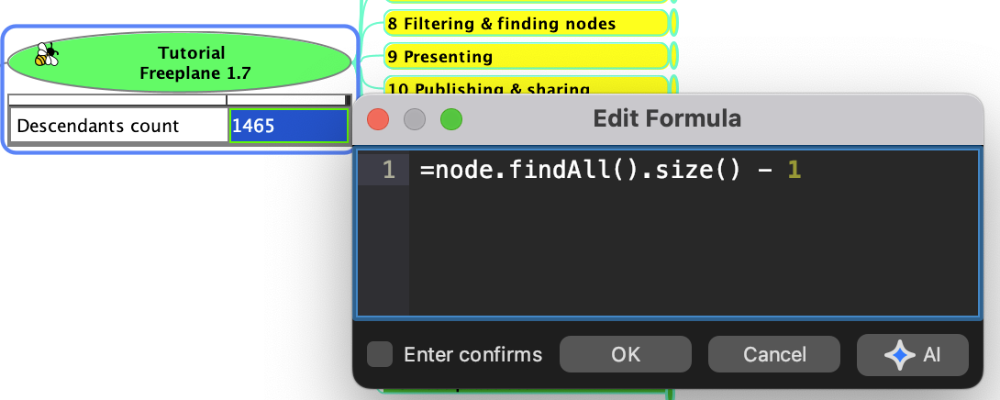
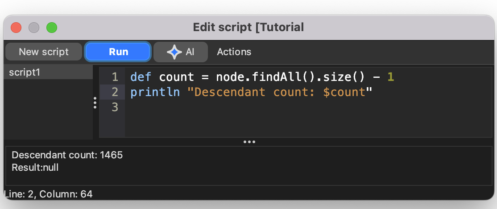
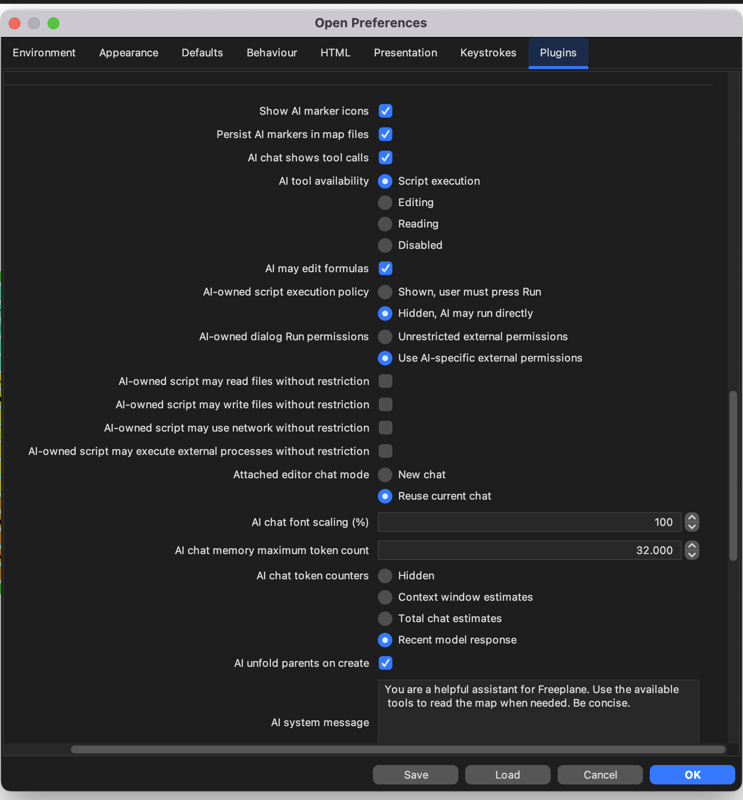

## AI formulas and script editing

The features on this page require Freeplane `1.13.3` or later.
The feature sections below repeat the settings they need.

## Benefits and risks

Benefits:

- AI can draft, explain, and repair formulas and scripts faster,
- editor attachment lets AI work with the live text you are currently
  editing.

Risks:

- formulas and scripts can be wrong or unsafe,
- models make mistakes, and prompt injection through map content or
  scripts cannot be fully excluded.

## Formula editing and execution with AI

To use this:

- `AI tool availability` must include `Editing` or `Script execution`.
- `AI may edit formulas` must be enabled.

Benefit: AI can help draft and repair formulas faster.

Risk: review any generated formula before submitting it, especially if
it refers to other nodes or searches the map.

`Formula Editor` can be attached to AI through its local `AI` button.

When you attach the editor, AI works with the **live text currently
open in that editor**, not only with already-saved map content.

*Formula Editor with the local AI attach button.*

The preference `Attached editor chat mode` decides whether attaching an
editor:

- opens a **new chat**, or
- **reuses the current chat**.

Only one open editor can be attached at a time.

## AI may edit formulas

This setting is required for any AI formula authoring or repair.
Without it, AI cannot help write or fix formulas even when ordinary AI
editing or script execution is enabled.

To let AI author or repair formulas, both of these must be true:

- `AI tool availability` must include `Editing` or `Script execution`.
- `AI may edit formulas` must be enabled.

This matters because AI formula authoring and execution-backed checks
are more restricted than normal text editing.

For general formula usage, formula execution failures, and optional AI
repair, see [Formulas](../scripting/Formulas.md).

## Block formula map edits

No AI permission is needed for this safeguard itself. It is a
formula-plugin preference and applies to all formulas.

Benefit: this blocks one important class of formula side effects.

Risk: if you disable it, formula evaluation can perform map edits when
the formula text does that.

The formula-plugin preference `Block formula map edits` is enabled by
default.

When enabled, formulas that try to apply map edits during evaluation or
validation can fail instead of changing the map. This includes cases
such as formulas that try to create child nodes.

This guard improves safety, but it is **not** a complete block on every
possible UI side effect. Formulas should still be treated as
value-computing expressions, not as a map-mutation mechanism.

## Script editing with AI

To use this:

- `AI tool availability` must include `Script execution`.

Benefit: AI can help draft, explain, and refactor Groovy scripts
faster.

Risk: AI-generated code is untrusted code and should be reviewed before
running it.

This attached editor flow helps AI edit the current script draft. For
execution of AI-owned scripts, see
[AI-owned script execution](ai-owned-script-execution.md).

`Edit script` can be attached to AI through its local `AI` button.

When you attach the editor, AI works with the **live text currently
open in that editor**, not only with already-saved map content.

*Script Editor with the local AI attach button and Arguments JSON field.*

The script editor also has an `Arguments JSON` field. When the editor
is attached to AI, AI can edit both the Groovy source and this JSON.
Use the field for data you do not want to quote inside the script, such
as longer text, lists, or structured values.

In the script, the parsed JSON value is available as `args`; a blank
field means `args == null`. Invalid JSON prevents compile/run until it
is fixed.

For map local script usage of `Arguments JSON`, see
[Map local scripts](../scripting/Map_local_scripts.md).

## Repair requests are consent-gated

When a submitted formula fails, Freeplane can show diagnostics and ask
whether AI should try to repair it. The repair request starts only if
you confirm.

When an attached script editor run fails, Freeplane records the failure
as attached editor state so AI can inspect it, but it does not
automatically submit a repair request. If repair is available, Freeplane
asks first; declining or closing the prompt leaves the failure state
recorded but does not contact the AI provider for repair.

## Prefer value-computing formulas and scripts

This guidance still applies when the relevant permissions are enabled.
For formulas and AI-owned scripts, prefer:

- `return` values for structured results,
- `println` for plain text output.

Avoid side effects unless you explicitly want them.
In particular, avoid:

- map-editing formulas,
- UI popup calls from scripts,
- scripts whose main purpose is to drive the interface.

## Practical setup for formula and script help

If you want most features on this page, a good default configuration is:

- `AI tool availability`: `Editing` or `Script execution`
- `AI may edit formulas`: enabled if you want AI to help with formulas
- `AI chat shows tool calls`: enabled if you want visible AI/MCP tool
  activity in chat

For AI-owned script execution settings, see
[AI-owned script execution](ai-owned-script-execution.md).

The preferences page below shows the main settings involved in these
workflows.

