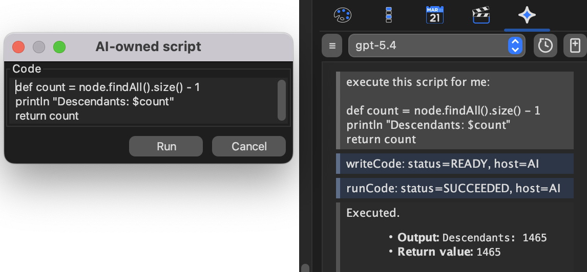

## AI formulas and script editing

The features on this page require Freeplane `1.13.3` or later.
Each section below repeats the settings it needs.

## Formula editing and execution with AI

To use this:

- `AI tool availability` must include `Editing` or `Script execution`.
- `AI may edit formulas` must be enabled.

`Formula Editor` can be attached to AI through its local `AI` button.

When you attach the editor, AI works with the **live text currently
open in that editor**, not only with already-saved map content.

*Formula Editor with the local AI attach button.*

The preference `Attached editor chat mode` decides whether attaching an
editor:

- opens a **new chat**, or
- **reuses the current chat**.

Only one open editor can be attached at a time.

## AI may edit formulas

This setting is required for any AI formula authoring or repair.
Without it, AI cannot help write or fix formulas even when ordinary AI
editing or script execution is enabled.

To let AI author or repair formulas, both of these must be true:

- `AI tool availability` must include `Editing` or `Script execution`.
- `AI may edit formulas` must be enabled.

This matters because AI formula authoring and execution-backed checks
are more restricted than normal text editing.

For general formula usage, formula execution failures, and optional AI
repair, see [Formulas](../scripting/Formulas.md).

## Block formula map edits

No AI permission is needed for this safeguard itself. It is a
formula-plugin preference and applies to all formulas.

The formula-plugin preference `Block formula map edits` is enabled by
default.

When enabled, formulas that try to apply map edits during evaluation or
validation can fail instead of changing the map. This includes cases
such as formulas that try to create child nodes.

This guard improves safety, but it is **not** a complete block on every
possible UI side effect. Formulas should still be treated as
value-computing expressions, not as a map-mutation mechanism.

## Script editing with AI

To use this:

- `AI tool availability` must include `Script execution`.

`Edit script` can be attached to AI through its local `AI` button.

When you attach the editor, AI works with the **live text currently
open in that editor**, not only with already-saved map content.

*Script Editor with the local AI attach button.*

## AI-owned script execution policy

This section matters only when `AI tool availability` includes `Script
execution`.

`AI-owned script execution policy` controls how AI-created scripts are
run:

- `Shown, user must press Run`
- `Hidden, AI may run directly`

In shown mode, Freeplane opens a review dialog so you can inspect the
script before running it.

If you want AI to run the script directly, this policy must be `Hidden,
AI may run directly`.
The separate `AI-owned dialog Run permissions` setting controls which
external permissions a user-started `Run` from that dialog uses.

*Shown mode is a review gate. The dialog is for script inspection and
Run/Cancel only.*

The shown dialog is not a results window. If you later see a popup with
script output, that popup usually comes from the script itself.

## Prefer value-computing formulas and scripts

This guidance still applies when the relevant permissions are enabled.
For formulas and AI-owned scripts, prefer:

- `return` values for structured results,
- `println` for plain text output.

Avoid side effects unless you explicitly want them.
In particular, avoid:

- map-editing formulas,
- UI popup calls from scripts,
- scripts whose main purpose is to drive the interface.

## Practical setup for formula and script help

If you want most features on this page, a good default configuration is:

- `AI tool availability`: `Editing` or `Script execution`
- `AI may edit formulas`: enabled if you want AI to help with formulas
- `AI-owned script execution policy`: `Shown, user must press Run`
- `AI chat shows tool calls`: enabled if you want visible AI/MCP tool
  activity in chat

The preferences page below shows the main settings involved in these
workflows.

