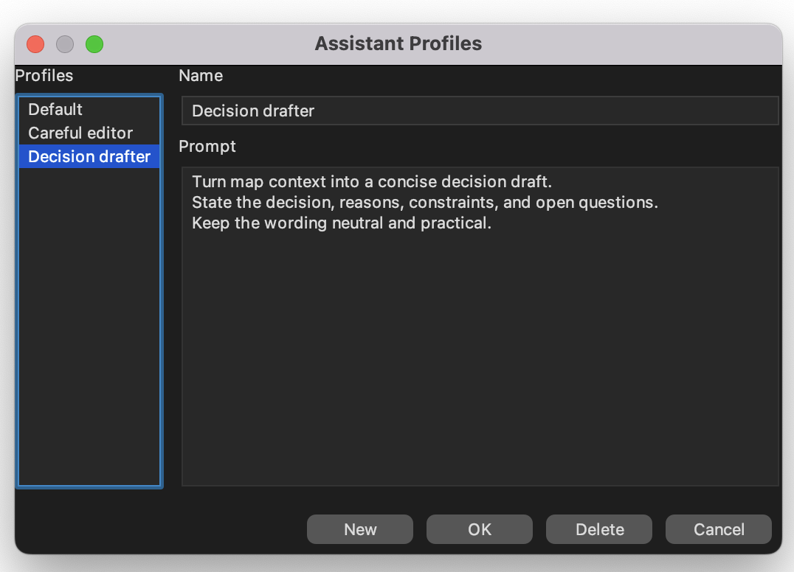
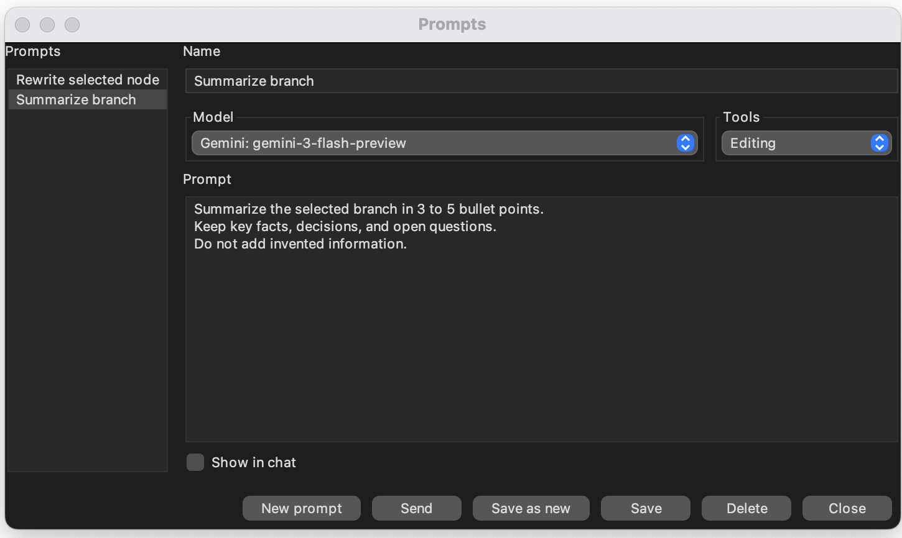

## AI prompts and profiles

The prompt features described on this page require Freeplane `1.13.3`
or later. Assistant profiles are documented here together because they
are closely related in everyday AI use.

## Profiles and prompts are not the same thing

**Assistant profiles** are reusable instructions for normal AI chat.
They help you keep a consistent role, tone, structure, or editing
policy across many requests.

**Prompts** are saved AI actions that you can run directly from menus.
A prompt can open its own chat or run in the background.

| Use case | Assistant profiles | Prompts |
| --- | --- | --- |
| Main purpose | Reusable chat behavior | Reusable saved action |
| Where you use it | `AI profile` in the AI chat panel | AI menus in the main menu and node popup |
| Stored settings | Name and instruction text | Name, prompt text, visibility, optional model, optional tools |
| Uses the current profile? | Yes | No. Prompt runs stay separate from assistant profiles. |

## Manage assistant profiles

Open `Manage profiles` from the AI panel to create or edit reusable
profiles.

*Assistant profiles store reusable chat instructions.*

Typical profile uses:

- careful editing,
- summarization,
- decision drafting,
- project-specific writing rules.

A profile affects normal AI chat. It does not create a separate saved
menu action.

## Manage prompts

Open `Edit prompts...` from the AI menus to create or edit saved
prompts.

*Prompts are saved actions with their own visibility, model, and tool
settings.*

Prompts can be run from:

- the main menu AI section,
- the node popup AI section,
- the prompts dialog itself.

In the prompt editor, the `Model` and `Tools` selectors are optional.
You can set them explicitly for that prompt, or leave them on the
current chat settings so the prompt uses the model and tool selection
already in effect.

Unlike assistant profiles, a prompt is meant to be executed directly.

## Where prompts and profiles are stored

Prompts and profiles are stored in your **Freeplane user directory**.
You can open that directory from `Tools > Open user directory`.

Files used by Freeplane:

- assistant profiles: `ai-assistant-profiles.json`
- prompts: `ai-prompts.json`

If you save or change prompts or profiles, these files are updated in
that user directory.

## Prompt behavior

Each prompt stores whether it should:

- **Show in chat** — open a fresh visible AI chat for the prompt, or
- run hidden — execute without replacing the currently visible chat.

Shown prompts open their own chat instead of appending to the previous
conversation.

Hidden prompts do not stay as saved visible chats. Freeplane can still
show progress while they run, and you can cancel them.

## Prompt-specific model and tool settings

A prompt can use:

- the current chat model and tool settings, or
- its own saved model and tool settings.

If a shown prompt opens a chat with its own model or tool setting, that
chat starts with the prompt's effective values. Later, if you change the
model or tools in that chat yourself, the chat returns to the normal
current-setting path.

## Profiles versus prompts in practice

Use a **profile** when you want AI chat to behave consistently across
many requests.

Use a **prompt** when you want a saved action you can launch directly,
for example:

- rewrite the selected node,
- summarize a branch,
- draft a decision,
- run a hidden background analysis.

A common pattern is:

1. use a profile for ordinary interactive chat,
2. use prompts for repeatable one-click actions.

Groovy scripts can also run saved prompts by name. For that scripting
API, see [Asking AI from scripts](../scripting/Asking_AI_from_scripts.md).
