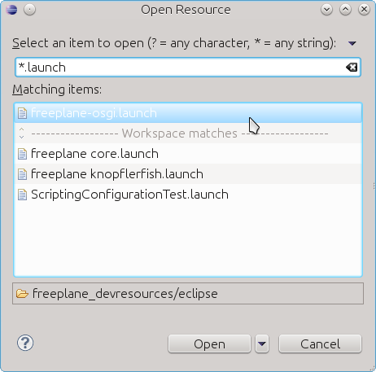
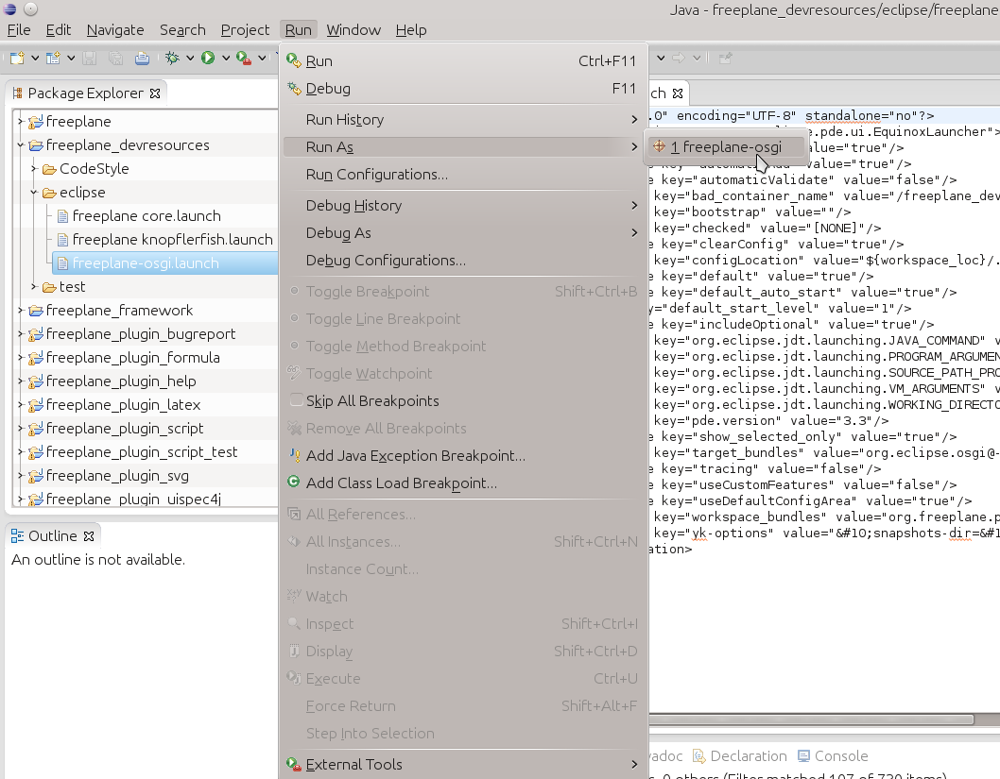
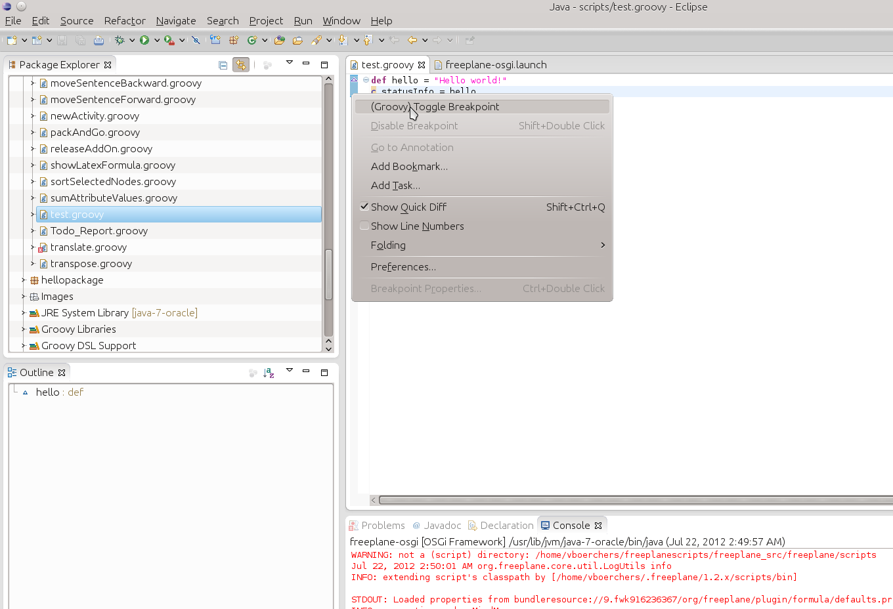
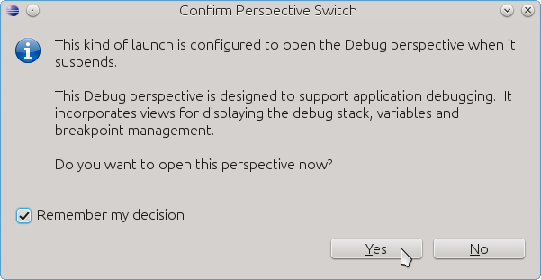
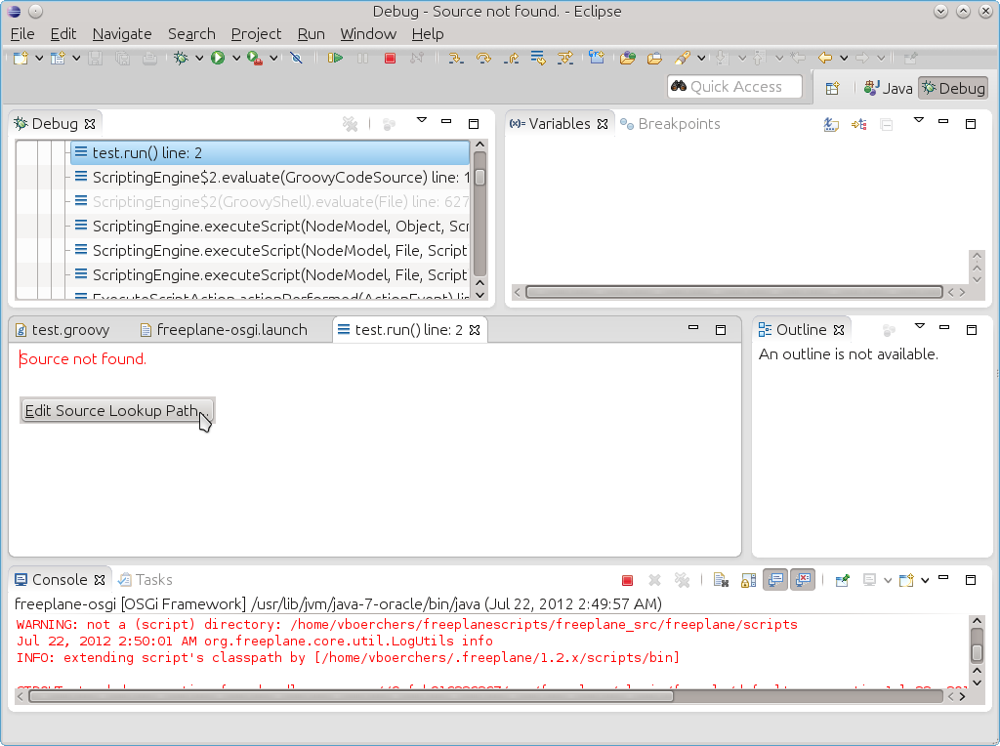
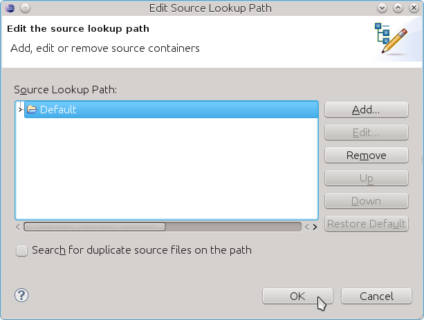
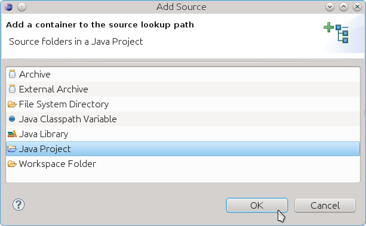
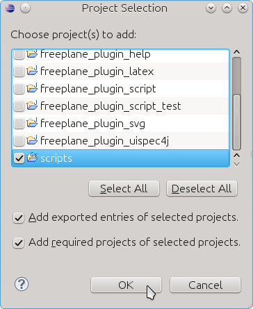
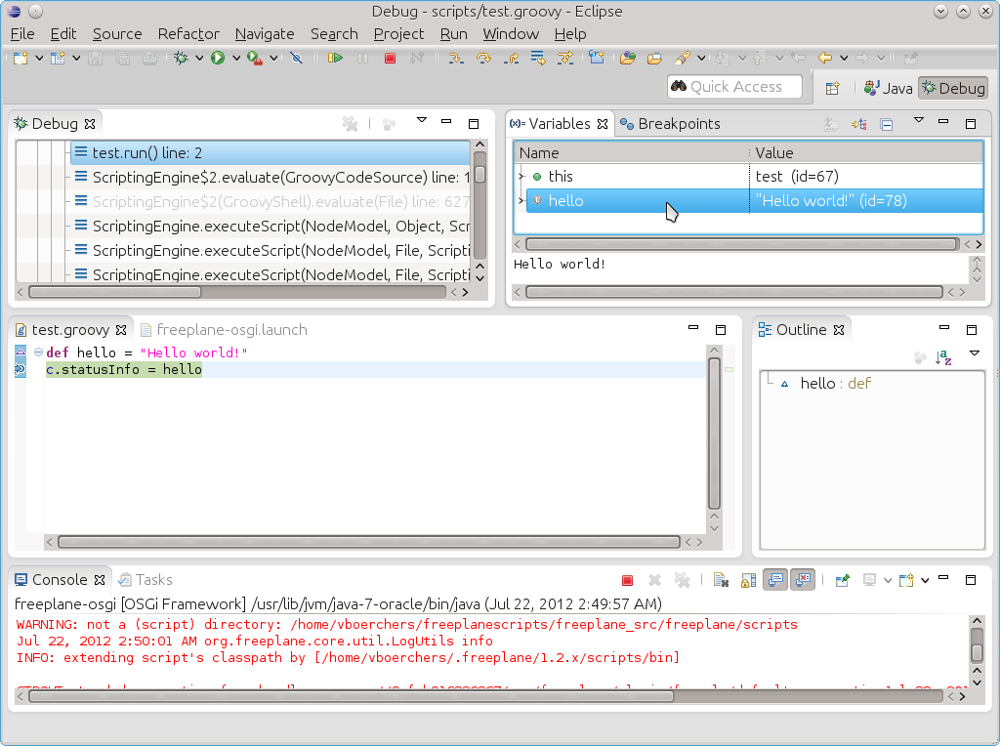

<!-- toc -->

Debugging allows to run scripts step by step, to inspect the content of script variables and to view the interaction between Freeplane and scripts. Debugging of scripts is a bit complicated at first but once you have mastered the first steps it will be easy.

Almost all your scripts will access properties from Freeplane - the selected node (<tt>node</tt>), the controller (<tt>c</tt>), ... Such scripts need a running Freeplane instance of course. That's why debugging of scripts starts with starting Freeplane. This must happen from Eclipse and in a special way since otherwise Eclipse will neither know about the Freeplane instance nor about your script you want to test.

1. Open the file *freeplane-osgi.launch* via the *Open resource* command (Ctrl+Shift+R):

2. The file describes how a Freeplane instance can be launched from Eclipse. Use it this way:

3. Let's assume you want to debug a script called test.groovy. The script execution should be stopped before executing the second line of code. Therefore we have to set a "Breakpoint" at this line. Open the context menu over the line with a right mouse click.

(By the way: In the lower part of the image below you can see the "Console" window. It contains Freeplane's log output - very helpful in case of errors. - You don't have to visit to logfile to inspect error traces.)

A faster way to add breakpoints is to double click in the left bar before the line. The breakpoint is visualized as a small blue point:

4. Then start the script in Freeplane. After some seconds Eclipse will get activated since the breakpoint in the script is hit. A dialog may appear in Eclipse:

5. Eclipse doesn't know yet where to look for the sources of the script. Click on "Edit Source Lookup Path"

6. In the following dialog click on *Add* then follow the screen shots

7. Finally the code line is displayed! In the "Variable" view in the upper right side corner you can inspect variables. For further instructions on how to use the Debugging perspective see the [Eclipse debugging perspective](http://www.vogella.com/articles/EclipseDebugging/article.html).

Enjoy!

<!-- ({Category:Script}) -->

