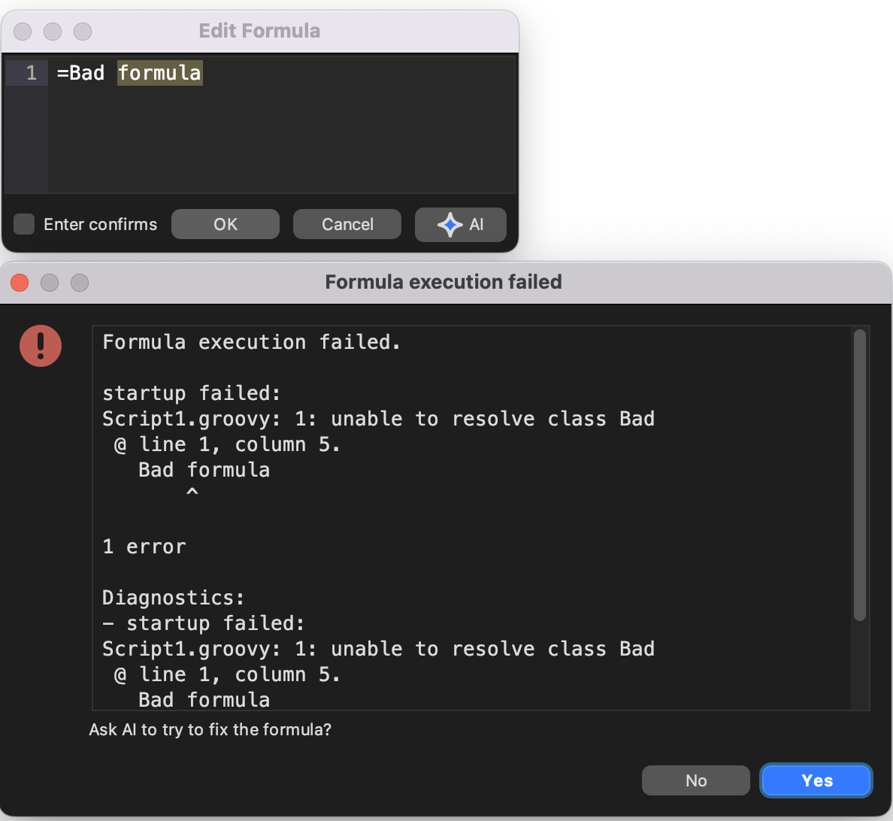

<!-- toc -->

# Formulas

Formulas let Freeplane compute values directly in your map, similar to
spreadsheet formulas.

A formula starts with `=` and displays its evaluated result instead of
the source text.

```groovy
=2 + 3
```

This displays `5`, while the formula text itself stays visible in the
formula editor.

## Where formulas can be used

Formulas can be defined in:

- node text,
- attribute values,
- notes.

In node text, the `=` must be the very first character.

## Formula editor support

When text already starts with `=`, Freeplane uses a dedicated formula
editor.

It supports:

- syntax highlighting,
- inserting references to other nodes,
- selecting and previewing referenced nodes while editing.

AI can also assist in writing formulas and scripts. See
[AI formulas and script editing](../ai/ai-formulas-and-script-editing.md).

## Formula execution failure and optional AI repair

In Freeplane `1.13.3` and later, if you submit a formula and execution
fails, Freeplane keeps the editor open, shows the diagnostics, and can
offer AI repair.

To use AI repair, first set up AI integration as described in
[AI integration: getting started](../ai/ai-integration-getting-started.md).



*A failed formula can offer an immediate AI repair path.*

This is useful when the formula is close to correct but still needs a
repair pass.

## Simple examples

```groovy
=3 * 2
```

This gives `6`.

```groovy
=(3 * 2) + " times"
```

This gives `6 times`.

```groovy
=children.sum(0){ it.to.num }
```

This sums the numerical values of all child nodes.

```groovy
=children.sum(0){ it['item'].num0 }
```

This sums the numeric `item` attribute across the children and treats
missing or non-numeric values as `0`.

## Formula model

Formulas are evaluated as Groovy expressions.
They use a read-only variant of the [Scripting API](Scripting_API.md).

In practice, that means formulas are meant to be **value-computing**.
They should read map content and compute a result, not drive the UI or
mutate the map.

Properties and methods of the current formula node are directly
available, so many formulas can omit the leading `node.`.

## References

Formulas can reference other nodes by:

- navigating the hierarchy, for example
  `=node.children`, `=node.parent`, or `=node.map.root`
- searching the map, for example
  `=node.find{ it.text == 'sum' }`
- referencing a specific node ID, for example
  `=ID_172581364.to.num`

To insert a node ID while the formula editor is open, double-click the
referenced node or use `Copy Node ID` from the node context menu.

## Circular references

As in spreadsheets, formulas can reference themselves indirectly and
create cycles.

Example:

```groovy
=parent.children.sum{ it.to.text }
```

A more realistic example:

```groovy
="count nodes above 10: " + node.find { it.to.num > 10 }.size()
```

The `find` call can trigger formula evaluation while evaluating the same
node again, which leads to a circular-reference error.

A safer version is:

```groovy
="count nodes matching '11': " + node.find { it.text == '11' }.size()
```

A practical rule: avoid `find` inside formulas unless you really need
it.

## What happens when the map changes

Formulas are updated automatically when necessary.

To keep formula updates efficient, Freeplane tracks dependencies and
reevaluates only formulas that depend on changed content.

If you suspect stale formula results, use:

- `Tools > Formulas > Evaluate all`

## Caching

Formula results are cached internally because the same values are often
read much more often than the map changes.

For debugging, the formula-plugin preferences let you disable formula
caching, but this can slow Freeplane down significantly.

## Formatting

Formatting of numbers and dates in node text is handled through normal
styles.
For attribute values, details, and notes you can format values with the
scripting helper:

- `format(Object, formatString)`

For related background, see
[Data recognition and data formats](../user-documentation/Data_recognition_and_data_formats.md).

## Security and map-edit blocking

Formulas have strict security limits.
They cannot write files, use the network, or execute external programs.

Freeplane `1.13.3` and later also adds a default-enabled safeguard:

- `Block formula map edits`

When this setting is enabled, formulas that try to apply map edits
while being evaluated or validated can fail instead of changing the map.
This is especially relevant for formulas that try to create nodes or
make other map changes.

This guard improves safety, but it is not a complete block on every
possible UI side effect. Formulas should still be written as
value-computing expressions.

For AI-assisted formula editing and repair, see
[AI formulas and script editing](../ai/ai-formulas-and-script-editing.md).

## When formulas get too big

If your formulas become large or repetitive, move shared logic into your
own Groovy utility classes or helper scripts.

See:

- [Your own utility script library](Your_own_utility_script_library.md)

## Where to go next

- [AI formulas and script editing](../ai/ai-formulas-and-script-editing.md) — use AI in the formula editor or repair a failed formula.
- [Scripting API](Scripting_API.md) — see which objects and methods formulas can read.
- [References and Cheatsheet](References_and_Cheatsheet.md) — quick lookup while writing formulas.
- [API/Groovy tutorial](api-groovy-tutorial.md) — learn the Groovy syntax used in formulas.
- [Your own utility script library](Your_own_utility_script_library.md) — move repeated logic out of large formulas.
- [Security considerations](Security_considerations.md) — understand the scripting and formula sandbox.
