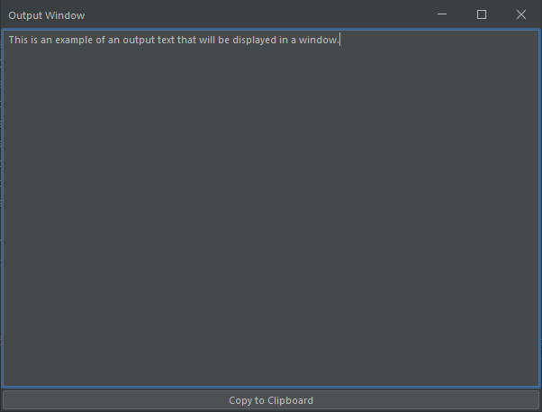

# GUI
Using simple GUI to display information on the screen, integrated into freeplane.

### Simple YES/NO Question

```groovy
import org.freeplane.core.ui.components.UITools;
def result = UITools.showConfirmDialog(node.delegate, "Simple Yes/No Question", "window title",0)
c.statusInfo=result
```

### Simple Msgbox
```groovy
import org.freeplane.core.ui.components.UITools;
UITools.informationMessage('Simple Messagebox')
```

### Display output in a window (+ copy button)
Code for displaying some output text in a window. Useful when running some function that returns an output.

```groovy
import javax.swing.JFrame;
import javax.swing.JTextArea;
import javax.swing.JScrollPane;
import javax.swing.JButton;
import javax.swing.JPanel;
import java.awt.BorderLayout;
import java.awt.Dimension;

def copy_textarea_to_clipboard(JTextArea textArea) {
    textUtils.copyToClipboard(textArea.getText());
    textArea.requestFocusInWindow(); 
    textArea.selectAll();
}

def show_output_window(String txt, String title="", int width=600, int height=400) {
    JFrame frame = new JFrame(title);
    JTextArea textArea = new JTextArea();
    textArea.setText(txt);
    textArea.setLineWrap(false);
    textArea.setWrapStyleWord(false);
    JScrollPane scrollPane = new JScrollPane(textArea);
    scrollPane.setPreferredSize(new Dimension(width, height));
    JButton copyButton = new JButton("Copy to Clipboard");
    copyButton.addActionListener(e -> copy_textarea_to_clipboard(textArea));
    JPanel contentPane = new JPanel(new BorderLayout());
    contentPane.add(scrollPane, BorderLayout.CENTER);
    contentPane.add(copyButton, BorderLayout.SOUTH);
    frame.setContentPane(contentPane);
    frame.pack();
    frame.setDefaultCloseOperation(JFrame.DISPOSE_ON_CLOSE);
    frame.setLocationRelativeTo(null);
    frame.setVisible(true);
}

show_output_window("This is an example of an output text that will be displayed in a window.", "Output Window");
```

result:

