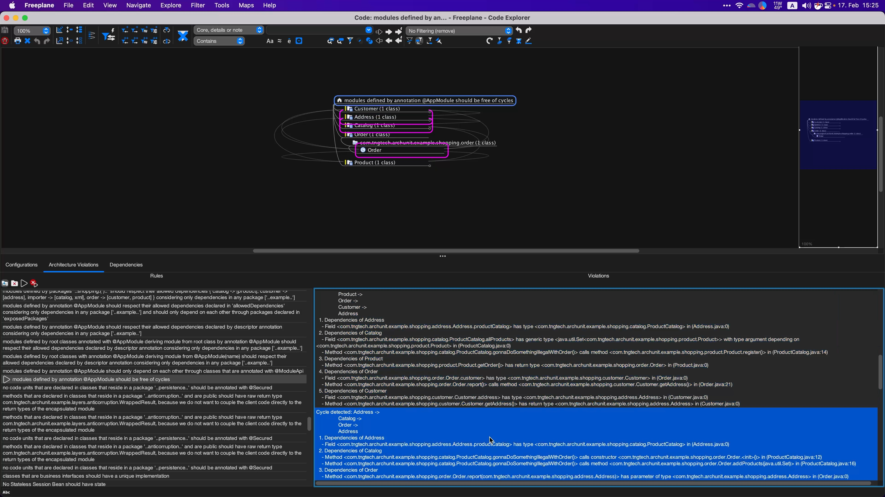

# Arch Unit Test Result Viewer

## Introduction

The Architecture Violations feature in Freeplane's Code Explorer mode is used to capture and display rule violations that are identified during the code analysis process. This is specifically related to the integration with the Freeplane ArchUnit extension.

## Architecture Violations Tab

### Overview

The Architecture Violations tab provides a mechanism to record and display violations reported by the ArchUnit tests.

### Buttons and Their Functions

- **Record ArchUnit Test Results**: This button starts a listener that receives test results from the Freeplane ArchUnit Extension.
- **Delete Configuration**: Removes the currently selected violation configuration.
- **Run Analysis**: Performs the analysis again to detect architecture violations. Double-click on the configuration has the same result.
- **Cancel**: Halts any ongoing analysis process.

### Violations Reporting

- Violated rules are reported and can be visualized as maps within the Architecture Violations tab.
- These violations are not saved across Freeplane restarts and are only available during the current session.

### Additional Information

- For persistent records of violations, users should manually save or document the information prior to exiting Freeplane.
- Detailed setup and usage guidelines for the Freeplane ArchUnit Extension are available on its [GitHub repository](https://github.com/freeplane/freeplane-archunit-extension).

## Note

Please ensure that the Freeplane ArchUnit Extension is correctly installed and configured to utilize the Architecture Violations feature effectively.
