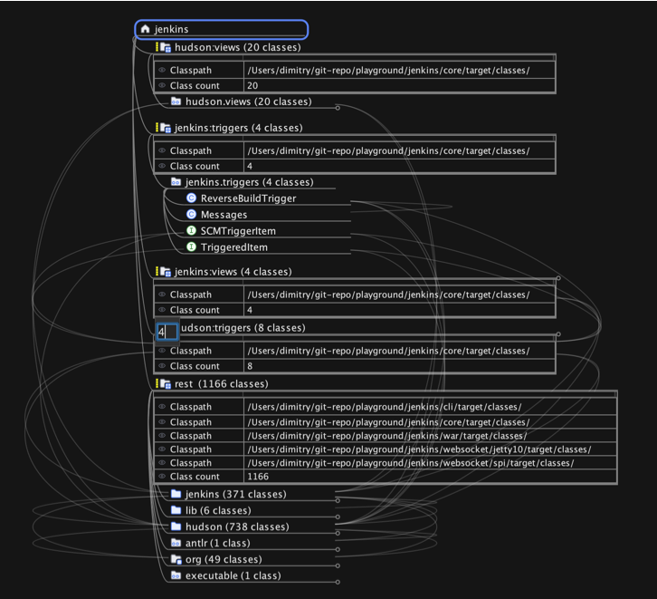

<!-- toc -->

# Freeplane Code Explorer Mode Documentation

## Introduction

The Code Explorer mode in Freeplane is designed for analyzing the structure and dependencies of code compiled to JVM class files.


## Accessing Code Explorer Mode

1. Launch Freeplane version 1.11.12 or later.
2. Navigate to the menu bar at the top of the application.
3. Click on `Maps`.
4. Select `Modes`.
5. Choose `Code Explorer` to enter the code explorer mode.

## Video Tutorials

Video tutorials are available to help users familiarize themselves with the Code Explorer mode. To access the tutorial, click [here](https://www.youtube.com/playlist?list=PLO1cupJqvEkJ1EkfOQucpnbNnlUcnDg8H) or navigate to the Help menu within Freeplane and select Help -> Code Explorer Introduction Video.

## Configurations Panel

### Configurations Tab

The Configurations tab allows users to manage their configurations and consists of three parts: configurations, locations, and rules.

#### Configurations

- **Add Configuration**: Click this button to create a new configuration.
- **Delete Configuration**: Use this button to remove the currently selected configuration.
- **Run Analysis**: Initiates the analysis process, loading and importing class files.
- **Apply Changes**: Attempts to apply only rule changes without reloading class files, if there are no location changes.
- **Cancel**: Allows users to cancel an analysis that has started but not yet finished.

#### Locations

- **Add JARs and Folders**: This button allows you to add new JAR files or folders to your configuration.
- **Remove Selected Locations**: This button will remove the currently selected locations from your configuration.
- **Ordering Buttons**: Adjust the priority order of locations, affecting which classes are imported when duplicates exist.

##### Location Details in Code Explorer

When adding locations for analysis in the Code Explorer mode, Freeplane processes directories differently based on their contents:

- **Maven Projects**: If the location is a directory containing a `pom.xml` file, Freeplane recognizes it as a Maven project. It will then look for class files specifically in the `target/classes/**` directory structure.

- **Gradle Projects**: If the location is a directory containing a `build.gradle` file, Freeplane identifies it as a Gradle project. It will search for class files within the `build/classes/**` directory structure.

- **Other Cases**: If the directory does not contain `pom.xml` or `build.gradle`, Freeplane will search for any `.class` files contained within any subdirectories.

This behavior allows Freeplane to adapt to different project structures and build systems, ensuring that only the relevant class files are included in the analysis.

#### Rules

Rules in the Code Explorer mode are used to specify allowed and forbidden dependencies, among other settings. Rules are defined in the following formats:

```
[command] [originPattern] [direction] [targetPattern]
classpath [path]
ignore class [classPattern]
import interface [classPattern]
import annotation [classPattern].[methodName]()
group [classPattern]
group [classPattern] as [group name]
ignore group [classPattern]
```

- **Revert**: Undoes the last change made to the rule configuration.
- **Help**: Provides documentation related to creating and managing rules.

## Analysis Results

After running an analysis with the "Run Analysis" button, the result is represented as an interactive mind map that visualizes all packages and classes.

### Mind Map Structure

- **Packages and Classes**: Displayed in a hierarchical format, with packages expanding to reveal classes contained within them.
- **Dependencies**: Represented as connectors between nodes on the mind map. All mind map nodes are automatically sorted to ensure that as many dependencies as possible are visualized as going down in the mind map. This sorting strategy aims to minimize the visual complexity and enhance the readability of the dependency graph. Dependencies that are depicted as going up in the mind map are significant as they always indicate the presence of dependency cycles. This visual cue helps in quickly identifying areas in the codebase that might require refactoring to eliminate circular dependencies.
- **Forbidden Dependencies**: Illustrated with red lines, these dependencies are configured in the rules to be disallowed.

### Dependencies Tab


The Dependencies tab dynamically updates with information as the selection within the mind map changes. It provides a detailed list of dependencies including verdict, origin, target, and the specific details about the nature of the dependency.

#### Filtering Dependencies

- The filter input field allows users to filter the list of dependencies by entering keywords or by specifying a column for searching using the format `column:keyword`.

## Rules Configuration in Code Explorer

Rules in the Code Explorer mode are pivotal for controlling how the application interprets the dependencies and structure within a JVM-compiled codebase. These rules are versatile, catering to a broad spectrum of analysis needs, from dependency management to enhancing the visibility of specific code elements within the mind map.

### Rule Definition Format

Rules are articulated on a per-line basis, conforming to formats that accommodate various directives, such as managing dependencies, augmenting the classpath, and more nuanced configurations like ignoring or grouping classes:

- Dependency directives: `[command] [originPattern] [direction] [targetPattern]`
- Augmenting classpath: `classpath [path]`
- Class-specific directives: `ignore class [classPattern]`, `import interface [classPattern]`, `import annotation [classPattern]`, `import annotation [classPattern].[methodName]()`
- Grouping directives: `group [classPattern]`, `group [classPattern] as [group name]`
- Ignoring groups: `ignore group [classPattern]`

### Commands for Dependency Management

Specific commands within the rules are designed to directly influence how dependencies are managed:

- `allow`, `forbid`, `ignore`, `group`: These commands serve as the foundation for defining allowed and forbidden dependencies, excluding specific dependencies from analysis, and organizing Java classes into logical groupings, respectively.

### Direction Indicators

Dependency directions are denoted by symbols that indicate the nature of the dependency flow:

- `->`: Represents a dependency that can go up or down in the mind map, aligning with the automatic sorting of nodes to optimize the visualization of dependencies.
- `->^`: Indicates a dependency going up in the mind map, highlighting dependency cycles.
- `->v`: Signifies a dependency going down in the mind map, following the natural flow of most dependencies after nodes are automatically sorted.

### Pattern Syntax

The syntax for patterns in rules utilizes an AspectJ-like formulation, enabling precise matching against package and class names for a targeted analysis.

### Group Commands

- `ignore group [classPattern]`: Excludes all classes matching the class pattern from dependency analysis. This command is useful for omitting specific groups of classes, such as test classes, from cluttering the analysis results.
- `group [classPattern] as [group name]`: Groups all classes matching the class pattern under a custom name. This name appears in the mind map, enhancing the organization of the analysis results. When parts of the class pattern are enclosed in round brackets, they are captured and appended to the group name, separated by a colon if there is more than one part. This feature allows for a dynamic and descriptive naming of groups based on the matched class structure.

For example, with the rules:

````
group (hudson|jenkins).(triggers|views)..
group .. as rest
````

Classes within the `hudson` or `jenkins` package trees and belonging to either the `triggers` or `views` subtrees will be grouped accordingly. Unmatched classes will be grouped under the name `rest`. In the mind map, this results in groups named `hudson:triggers`, `hudson:views`, `jenkins:triggers`, and `jenkins:views`, clarifying the organization of the codebase at a glance.



### Utilizing Classpath

Multiple `classpath` directives can be declared to specify the directories to be scanned for classes, superseding the default directories (`target/classes`, `build/classes`, `.`), thus offering flexibility in accommodating various project structures.

### Usage Notes

- Comments: Lines prefixed with `#` or `//` are treated as comments and ignored, allowing for annotations within the rules file.
- The AspectJ-like pattern matching system underpins the flexibility in specifying classes, interfaces, annotations, and groups, ensuring that the rules can be finely tuned to the project’s specific requirements.

By addressing these aspects, the documentation now comprehensively covers the functionalities related to rules within the Code Explorer mode, including the previously omitted details about group management and pattern usage.

## Class Filters and Dependency Exploration Options

Available in both the toolbar and the "Explore" menu, Freeplane's Code Explorer mode offers a comprehensive set of actions for quickly applying special filters related to dependency analysis. These actions can be used in combination with the general filter tools on the toolbar and within the filter menu for an in-depth analysis. The "Explore" menu extends these capabilities, providing additional actions for more advanced analysis and allowing for a more detailed exploration of the code's structure and dependencies.

### "Show Dependencies Going Outside" Toggle

The "Show dependencies going outside" function in the Code Explorer mode is a toggle button that changes the scope of the dependency analysis:

- **When selected**: Freeplane will analyze dependencies that extend beyond the currently selected nodes. This includes any external dependencies that classes, packages, or package trees have with nodes outside of the selected scope.

- **When not selected**: The analysis will focus on the dependencies between the selected nodes only, ignoring any external connections.

Users can activate or deactivate this toggle at any time to adjust the analysis to either include or exclude external dependencies based on their current requirements.


### Filtering by External Dependencies

The "Filter by external dependencies" action, available in both the toolbar and the Explore menu, is influenced by the "Show dependencies going outside" toggle:

- **With the toggle selected**: Applying the filter will cause Freeplane to display only the classes that have dependencies going outside the selected nodes. All other classes and their corresponding packages that do not have external dependencies will be hidden from view.

- **With the toggle not selected**: When this filter is applied, it will only keep visible the classes that have dependencies between them within the selected scope. Classes that do not have internal dependencies within the selected nodes will be hidden.

This feature allows users to concentrate on the classes that interact with external components or those that interact within a defined scope, depending on the analysis requirement.


### Actions for Revealing Classes

In the Code Explorer mode, a suite of actions is available to reveal dependencies of nodes. These actions become helpful after applying a filter, enabling a focused analysis on specific classes.

#### Toolbar Actions

On the toolbar, there are actions to reveal dependencies for the selected nodes:

- **Show Direct Subclasses and Subinterfaces of the Selected Nodes**: Reveals nodes that are subclasses or subinterfaces directly extending or implementing the selected nodes, providing a focused, immediate view of the inheritance structure.
- **Show Subclasse and Subinterface Hierarchy of the Selected Nodes**: Reveals nodes that represent the full subclass and subinterface hierarchy of the selected nodes, displaying both direct and indirect descendants in the inheritance chain.
- **Show Direct Superclasses and Superinterfaces of the Selected Nodes**: Reveals nodes that are superclasses or superinterfaces from which the selected nodes directly inherit or extend, offering a direct view of parent classes or interfaces.
- **Show Superclass and Superinterface Hierarchy of the Selected Nodes**: Reveals nodes that encompass the complete superclass and superinterface hierarchy above the selected nodes, tracing all hierarchical layers back to the top-level ancestors.
- **Show Incoming Dependencies of the Selected Nodes**: Reveals nodes that are direct or recursive dependencies entering the selected nodes.
- **Show Outgoing Dependencies of the Selected Nodes**: Reveals nodes that are direct or recursive dependencies exiting the selected nodes.
- **Show Connected Dependencies of the Selected Nodes**: Reveals nodes that have direct or recursive dependencies connected to the selected nodes.

These actions on the toolbar allow users to visualize the dependencies in a more targeted manner.

#### Explore Menu Actions

The Explore menu offers additional actions that include the capabilities of the toolbar and further:

- Actions to reveal dependencies for all visible nodes, not just the selected ones. This provides a broader view of the codebase's architecture.
- Options to reveal both direct and recursive dependencies, offering a detailed exploration of the code structure.

These menu actions are helpful for expanding the analysis to understand the broader context of the dependencies within the entire visible code structure. By leveraging these tools, users can deepen their understanding of the interdependencies within their codebase.

### Cyclic Dependencies Analysis

In the Code Explorer mode, Freeplane includes actions to analyze and visualize cyclic dependencies involving the selected classes or packages.

#### Toolbar and Explore Menu Actions

- **Filter selected nodes by selected element cycles**: When this action is triggered, Freeplane checks for cyclic dependencies that include the selected class or package. If a cycle is found, the view is updated to hide all classes and packages that are not part of the cycle, making the cycle's structure clear and focused.
- **Select nodes by selected element cycles**: This action also checks for cyclic dependencies. If it identifies a cycle, it selects all classes and packages that are part of the cycle within the mind map. If no cycles are found, there will be no change to the selection or visibility of the nodes.

These actions are useful for pinpointing and resolving cyclic dependencies, which are often indicators of potential design issues that can complicate the maintainability of a codebase. By utilizing these features, developers can ensure their code's architecture adheres to best practices and remains clean and manageable.

