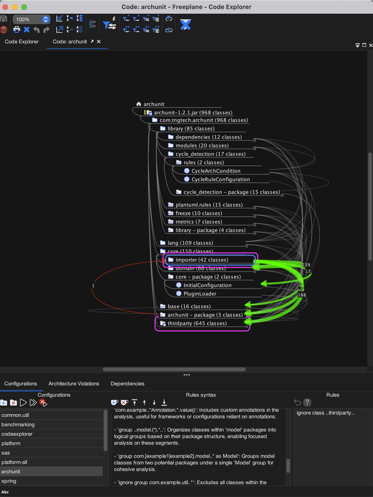
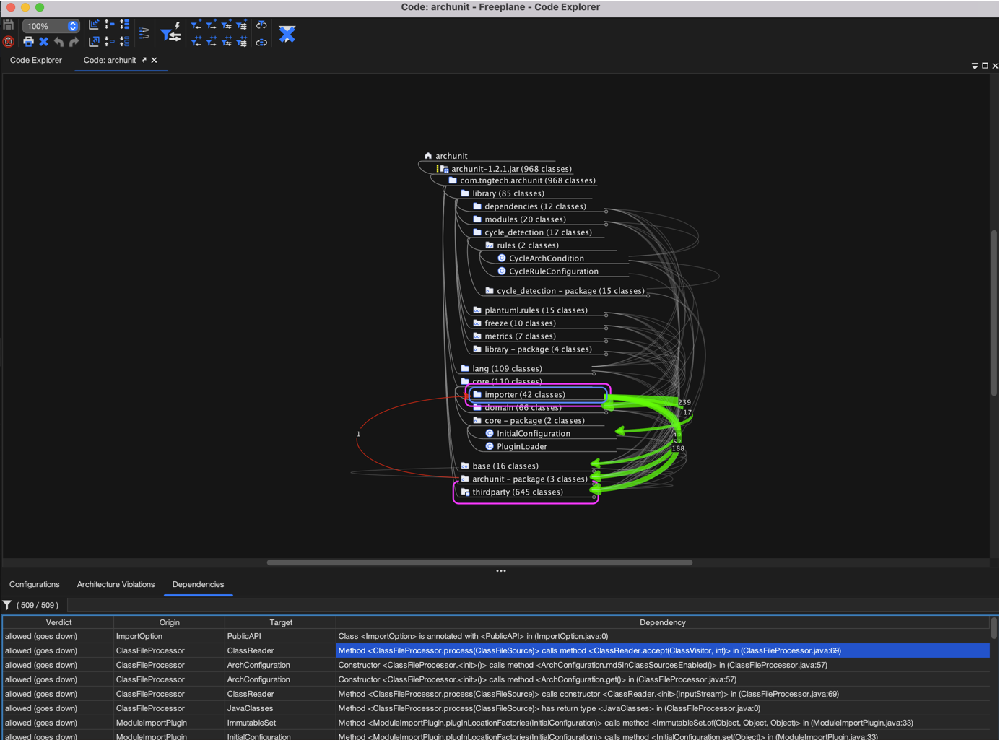

<!-- toc -->

# Freeplane Code Explorer Mode Documentation

## Introduction

The Code Explorer mode in Freeplane is designed for analyzing the structure and dependencies of code compiled to JVM class files.



## Accessing Code Explorer Mode

1. Launch Freeplane version 1.11.12 or later.
2. Navigate to the menu bar at the top of the application.
3. Click on `Maps`.
4. Select `Modes`.
5. Choose `Code Explorer` to enter the code explorer mode.

## Video Tutorials

Video tutorials are available to help users familiarize themselves with the Code Explorer mode. To access the tutorial, click [here](https://www.youtube.com/playlist?list=PLO1cupJqvEkJ1EkfOQucpnbNnlUcnDg8H) or navigate to the Help menu within Freeplane and select Help -> Code Explorer Introduction Video.

## Configurations Panel

### Configurations Tab

The Configurations tab allows users to manage their configurations and consists of three parts: configurations, locations, and rules.

#### Configurations

- **Add Configuration**: Click this button to create a new configuration.
- **Delete Configuration**: Use this button to remove the currently selected configuration.
- **Run Analysis**: Initiates the analysis process, loading and importing class files.
- **Apply Changes**: Attempts to apply only rule changes without reloading class files, if there are no location changes.
- **Cancel**: Allows users to cancel an analysis that has started but not yet finished.

#### Locations

- **Add JARs and Folders**: This button allows you to add new JAR files or folders to your configuration.
- **Remove Selected Locations**: This button will remove the currently selected locations from your configuration.
- **Ordering Buttons**: Adjust the priority order of locations, affecting which classes are imported when duplicates exist.

##### Location Details in Code Explorer

When adding locations for analysis in the Code Explorer mode, Freeplane processes directories differently based on their contents:

- **Maven Projects**: If the location is a directory containing a `pom.xml` file, Freeplane recognizes it as a Maven project. It will then look for class files specifically in the `target/classes/**` directory structure.

- **Gradle Projects**: If the location is a directory containing a `build.gradle` file, Freeplane identifies it as a Gradle project. It will search for class files within the `build/classes/**` directory structure.

- **Other Cases**: If the directory does not contain `pom.xml` or `build.gradle`, Freeplane will search for any `.class` files contained within any subdirectories.

This behavior allows Freeplane to adapt to different project structures and build systems, ensuring that only the relevant class files are included in the analysis.

#### Rules

Rules in the Code Explorer mode are used to specify allowed and forbidden dependencies, among other settings. Rules are defined in the following formats:

```
[command] [originPattern] [direction] [targetPattern]
classpath [path]
ignore class [classPattern]
import interface [classPattern]
import annotation [classPattern].[methodName]()
group [classPattern]
group [classPattern] as [group name]
ignore group [classPattern]
```

- **Revert**: Undoes the last change made to the rule configuration.
- **Help**: Provides documentation related to creating and managing rules.

## Rules Configuration in Code Explorer

Rules within the Code Explorer mode are essential for defining how the application analyzes and interprets the dependencies of the codebase. They are expressed in a specific format and cater to various aspects of the analysis.

### Rule Definition Format

Rules are declared one per line, and each rule comprises distinct parts, including commands, patterns, and optionally, directions and targets:

- Dependency management: `[command] [originPattern] [direction] [targetPattern]`
- Classpath definition: `classpath [path]`
- Class and group management: `[command] [classPattern]`

### Commands for Dependency Management

The following commands are related specifically to dependency analysis:

- `allow`: Allows dependencies from the origin to the target as defined by the patterns.
- `forbid`: Blocks dependencies from the origin to the target as defined by the patterns.
- `ignore`: Omits specified dependencies from the analysis.
- `group`: Organizes classes into logical groups for more structured analysis.

### Direction Indicators

For dependency commands, a direction indicator shows the dependency flow:

- `->`: A standard dependency from the origin to the target.
- `->v`: A dependency moving downwards in the package hierarchy.
- `->^`: A dependency moving upwards in the package hierarchy.

### Additional Commands

Beyond dependency management, there are commands for broader configuration:

- `classpath [path]`: This command allows specifying multiple relative directories to be searched for classes, replacing the default search locations (`target/classes`, `build/classes`, `.`). Users can define several `classpath` rules to include different directories according to their project's structure and build outputs.
- `ignore class`: Excludes specific classes from analysis.
- `import interface [classPattern]`: Imports interfaces that match the specified pattern as node attributes in the mind map, making them available for filtering and analysis.
- `import annotation [classPattern]` and `import annotation [classPattern].[methodName]()`: Imports annotations that match the specified pattern as node attributes in the mind map, allowing them to be used for filtering and detailed analysis.

### Pattern Syntax

Patterns follow an AspectJ-like syntax, enabling matching of complex package and class structures.

### Rule Examples

Examples of rules include:

- Allowing services to depend on repositories:
allow .service. -> .repository.

- Forbidding controllers from depending on models:
forbid ..controller*.. ->^ ..model..

- Ignoring dependencies from utility classes to helpers:
ignore ..util.. ->v ..*Helper..

### Usage Notes

- Comments can be added to rules using `#` or `//`, and such lines are ignored during analysis.
- The grouping command helps to visualize code architecture by aggregating related classes.

The above structure ensures that each aspect of rule configuration is documented with precision, adhering to the confirmed functionalities of the Code Explorer mode.

## Analysis Results

After running an analysis with the "Run Analysis" button, the result is represented as an interactive mind map that visualizes all packages and classes.

### Mind Map Structure

- **Packages and Classes**: Displayed in a hierarchical format, with packages expanding to reveal classes contained within them.
- **Dependencies**: Represented as connectors between nodes on the mind map.
- **Forbidden Dependencies**: Illustrated with red lines, these dependencies are configured in the rules to be disallowed.

### Dependencies Tab



The Dependencies tab dynamically updates with information as the selection within the mind map changes. It provides a detailed list of dependencies including verdict, origin, target, and the specific details about the nature of the dependency.

#### Filtering Dependencies

- The filter input field allows users to filter the list of dependencies by entering keywords or by specifying a column for searching using the format `column:keyword`.

## Class Filters and Dependency Exploration Options

Available in both the toolbar and the "Explore" menu, Freeplane's Code Explorer mode offers a comprehensive set of actions for quickly applying special filters related to dependency analysis. These actions can be used in combination with the general filter tools on the toolbar and within the filter menu for an in-depth analysis. The "Explore" menu extends these capabilities, providing additional actions for more advanced analysis and allowing for a more detailed exploration of the code's structure and dependencies.

### "Show Dependencies Going Outside" Toggle

The "Show dependencies going outside" function in the Code Explorer mode is a toggle button that changes the scope of the dependency analysis:

- **When selected**: Freeplane will analyze dependencies that extend beyond the currently selected nodes. This includes any external dependencies that classes, packages, or package trees have with nodes outside of the selected scope.

- **When not selected**: The analysis will focus on the dependencies between the selected nodes only, ignoring any external connections.

Users can activate or deactivate this toggle at any time to adjust the analysis to either include or exclude external dependencies based on their current requirements.


### Filtering by External Dependencies

The "Filter by external dependencies" action, available in both the toolbar and the Explore menu, is influenced by the "Show dependencies going outside" toggle:

- **With the toggle selected**: Applying the filter will cause Freeplane to display only the classes that have dependencies going outside the selected nodes. All other classes and their corresponding packages that do not have external dependencies will be hidden from view.

- **With the toggle not selected**: When this filter is applied, it will only keep visible the classes that have dependencies between them within the selected scope. Classes that do not have internal dependencies within the selected nodes will be hidden.

This feature allows users to concentrate on the classes that interact with external components or those that interact within a defined scope, depending on the analysis requirement.


### Actions for Revealing Classes

In the Code Explorer mode, a suite of actions is available to reveal dependencies of nodes. These actions become helpful after applying a filter, enabling a focused analysis on specific classes.

#### Toolbar Actions

On the toolbar, there are actions to reveal dependencies for the selected nodes:

- **Show Incoming Dependencies of the Selected Nodes**: Reveals nodes that are direct or recursive dependencies entering the selected nodes.
- **Show Outgoing Dependencies of the Selected Nodes**: Reveals nodes that are direct or recursive dependencies exiting the selected nodes.
- **Show Connected Dependencies of the Selected Nodes**: Reveals nodes that have direct or recursive dependencies connected to the selected nodes.

These actions on the toolbar allow users to visualize the dependencies in a more targeted manner.

#### Explore Menu Actions

The Explore menu offers additional actions that include the capabilities of the toolbar and further:

- Actions to reveal dependencies for all visible nodes, not just the selected ones. This provides a broader view of the codebase's architecture.
- Options to reveal both direct and recursive dependencies, offering a detailed exploration of the code structure.

These menu actions are helpful for expanding the analysis to understand the broader context of the dependencies within the entire visible code structure. By leveraging these tools, users can deepen their understanding of the interdependencies within their codebase.

### Cyclic Dependencies Analysis

In the Code Explorer mode, Freeplane includes actions to analyze and visualize cyclic dependencies involving the selected classes or packages.

#### Toolbar and Explore Menu Actions

- **Filter selected nodes by selected element cycles**: When this action is triggered, Freeplane checks for cyclic dependencies that include the selected class or package. If a cycle is found, the view is updated to hide all classes and packages that are not part of the cycle, making the cycle's structure clear and focused.
- **Select nodes by selected element cycles**: This action also checks for cyclic dependencies. If it identifies a cycle, it selects all classes and packages that are part of the cycle within the mind map. If no cycles are found, there will be no change to the selection or visibility of the nodes.

These actions are useful for pinpointing and resolving cyclic dependencies, which are often indicators of potential design issues that can complicate the maintainability of a codebase. By utilizing these features, developers can ensure their code's architecture adheres to best practices and remains clean and manageable.

