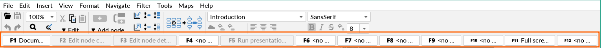
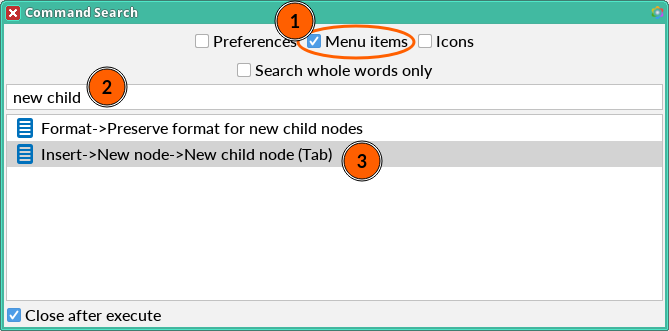

<!-- toc -->

## Hot Keys
Freeplane allows to assign hot keys (aka keyboard shortcuts) to any action available in the menu, as well as to icons.

It is most apparent in `View->Controls->F-Bar`.

By default `Preferences…->Keystrokes->Commands for the program->Ignore unassigned F-Keys` is off, therefore a click on (usage of) an unassigned F-Bar key displays a prompt to "click on the desired command in the menu" to "create a new keyboard shortcut".

### Hot Keys for Actions

Let's say that you want to use `INSERT` to add new child nodes, instead of the default `TAB`.

**Method 1**\
You can go to `Tools->Assign hot key`, a pop-up window appears with the message "To create a new keyboard shortcut, click on the desired command in the menu".
Once you click on `Insert->New node->New child node`, a pop-up prompts you to use your new hot key and click `OK`.

**Method 2**\
Go to `Insert->New node->New child node`, hold `Ctrl` and click.
A pop-up prompts you to use your new hot key and click `OK`.

**Method 3**\
You can launch the **Command Search** via `Help->Command Search` or its hot key `Ctrl+F1`.

1. Make sure `Menu items` is checked.
2. Type `new child` in the search bar.
3. Hold `Ctrl` and double-click `Insert->New node->New child node (Tab)`.
   A pop-up will appear, where the new hot key can be assigned.

**_Bonus_**\
In step 3, when you select `Insert->New node->New child node (Tab)` and press `Ctrl+C`,
the visible text is copied to the clipboard.
It can be pasted e.g. in a Discussions post.

### Hot Keys for Icons

Similarly, a hot key can be assigned to an icon.
It can be done using one of the methods described in [Hot Keys for Actions](#hot-keys-for-actions),
i.e. (for the "Home" icon):
1. `Tools->Assign hot key` then `Insert->Icons->Icon by category...->Miscellaneous->Home`
2. `Insert->Icons->Icon by category...->Miscellaneous->Home` then `Ctrl+click`
3. `Help->Command Search` and checkbox `Icons` and type "home" then `Ctrl+double-click`

Additionally, in `Insert->Icons->Icon from table… (Ctrl+F2)` you can `Ctrl+click` on an icon to assign it a **_ctrl key_**,
i.e. a hot key which works only in this window and uses `Ctrl` as its (first) modifier.
`Shift` can be used as the second.

## Keyboard Shortcuts

### Ctrl+C

Beyond the usual functionality of copying selected text or copying a node (branch),
`Ctrl+C` copies the selected item's text in the following places:

* Command Search - `Help->Command Search`
* Filter composer - `Filter->Compose filter`
* Attributes table - `Edit->Node properties->Edit attribute in-line (Alt+F9)`
* Find and replace - `Edit->Find->Find and replace… (Ctrl+Shift+F)`
* FInd and replace in all maps - `Edit->Find->Find and replace in all maps`
* Mange reminders - `Tools->Manage tasks and reminders…`
* Past reminders - `Tools->Show past reminders…`

## Mouse Actions with Keyboard Modifiers

### Alt

- You can change the width of a node under the cursor (or several selected nodes) 
by `Alt+scroll`

### Ctrl

- You can create a copy of a node (branch) by `Ctrl+drag` of a node onto another node
- You can change `Distance between children` (in `View->Controls->Tool panel` > Node layout) by `Ctrl+drag` of a node handle away or towards the center of node's stack of siblings
- You can follow a link by `Ctrl+click`, if `Preferences…->Behaviour->Open node link on simple mouse click` is off

### Shift

- Since v1.11.5, you can open a **link to a node** in another map view by `Shift+click` (in node core or in attributes).
If the mind map has no other view, it will be opened in a new tab.\
Here's the original Feature Request:
[option to open internal links in another map view of same map](https://github.com/freeplane/freeplane/issues/316)

### Ctrl+Shift

- You can create a connector to another node by `Ctrl+Shift+drag` of a node onto another node

