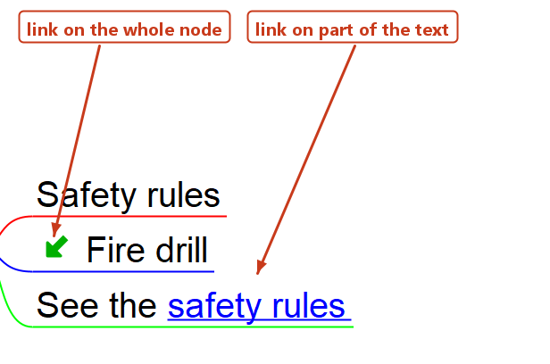

# Links to nodes

A hyperlink in Freeplane does not have to point at a file or a web page. It can point at a **node** — in the same map or in another map — and following it selects that node, switching to the other map if needed.

The link can sit on the whole node, or on a few words inside the node text. Both kinds are shown below: `Fire drill` carries the link on the node, and `See the safety rules` carries it on two words of its text.

## Copying the address of the target node

Select the node you want to link **to**, then use one of:

- `Edit->Copy->Copy node ID` copies the bare id, like `ID_1234567`. Node ids are unique within one map only.
- `Edit->Copy->Copy node URI` copies a complete address, like `freeplane:/%20/C:/maps/handbook.mm#ID_1234567`. It carries the map along, so it also works from another map and from outside Freeplane.

## Linking the whole node

The shortest way needs no copying at all:

1. Select the target node and use `Insert->Link->Set link anchor`.
2. Select the node that should carry the link and use `Insert->Link->Make link to anchor`.

Freeplane then writes `#ID_1234567` when both nodes are in the same map, and `handbook.mm#ID_1234567` when they are not.

Two other ways:

- `Insert->Link->Add hyperlink (URL)…` (`Ctrl+K`) opens a text field where you can paste any of the addresses above.
- `Insert->Link->Add local hyperlink` (`Alt+Shift+L`) works on a selection of **two or more** nodes: the node selected last becomes the target, and every other selected node gets a link to it.

A node that carries a link shows a small arrow before its text.

## Linking part of the node text

1. Press `Alt+Enter` (`Edit->Node core->Edit node core in dialog`) to open the node in the rich text editor.
2. Select the words that should become the link.
3. In the editor's own `Edit` menu, choose `Edit Hyperlink Manually…` (`Ctrl+H`), and type or paste the address.

Every address that works for a whole node works here too:

| Address | Points at |
| --- | --- |
| `#ID_1234567` | a node in the same map |
| `handbook.mm#ID_1234567` | a node in another map, path relative to the current map |
| `freeplane:/%20/C:/maps/handbook.mm#ID_1234567` | a node in another map, by absolute path — this is what `Copy node URI` gives you |

One node can hold several such links. They are drawn as links — blue and underlined — without any extra formatting on your part.

## Following a link

- A **plain click** on the link follows it. This is the default; the option is `Preferences…->Behaviour->Open node link on simple mouse click`.
- With that option off, `Ctrl+click` follows the link instead.
- `Shift+click` opens the target in the other map view — see [Hot keys and beyond](hot-keys-and-beyond.md).

The mouse pointer turns into a hand over any part of the text that carries a link, which is the quickest way to check that a link was really applied to the words you meant.

## When a link does nothing

- **A `file:` address written with a plain space.** `file:/C:/my maps/handbook.mm#ID_1234567` is not followed, and nothing is reported. Write the space as `%20`, or use `Copy node URI`, which encodes it for you. A relative address (`my map.mm#ID_1234567`) and a plain path (`C:\my maps\handbook.mm#ID_1234567`) are fine as they are, spaces included — only the `file:` form needs the encoding.
- **The target id is not in the target map.** The status bar shows `Link … not found`. Since ids are unique only within a map, a node copied into another map can share an id with a node already there; prefer the anchor commands or `Copy node URI` over typing ids by hand.
