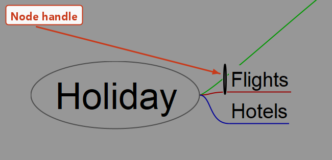
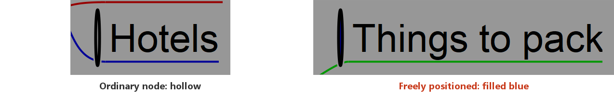
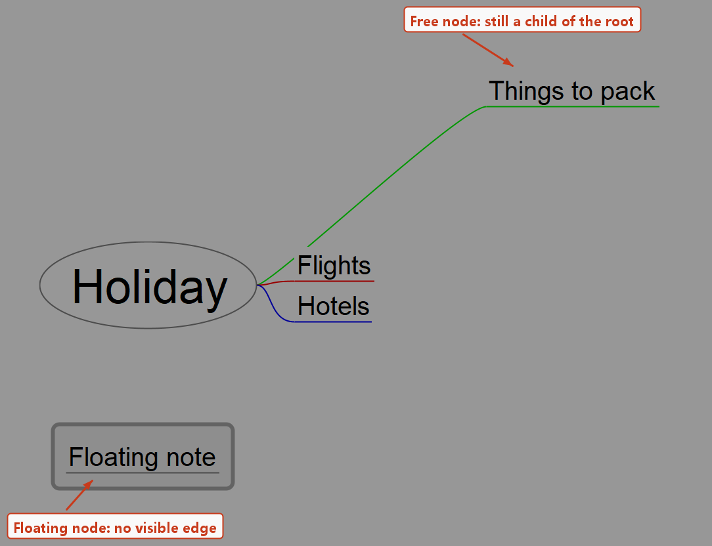

<!-- toc -->

# Positioning nodes by hand

Freeplane arranges a map automatically: children are stacked next to their parent and the layout keeps itself tidy while the map grows.
When that arrangement is not what you want, single nodes can be nudged, moved freely, or detached from the layout altogether.

All of it happens through one small control: the **node handle**.

## The node handle

The handle is not painted all the time.
Move the mouse just **outside** the node, on the side that faces its parent — the left side for nodes on the right branch, the right side for nodes on the left branch.
A narrow oval appears there and the cursor turns into a move cursor.

The handle is only a few pixels wide, so it is easy to walk past it.
It is the place to grab: **dragging the node itself is drag & drop**, which moves the node to another parent instead of repositioning it.

The root node has no handle, and handles do not exist in outline view.

## Moving a node

Drag the handle:

* a drag that goes mostly one way moves the node only that way;
* it starts moving in both directions at once as soon as the pointer has travelled more than 8 px in **each** direction, or immediately if **Shift** is held — so hold Shift for a small diagonal nudge;
* if a grid size is set in `Tools->Preferences…->Behaviour`, positions snap to that grid.

Two shortcuts on the same handle:

* **`Ctrl`+drag** leaves the node where it is and changes the spacing between *all* children of the parent — the `Distance between children` property in the tool panel.
* **Double-click** puts the node back to its automatic position. `Edit->Reset node position` (`Ctrl+R`) does a little more: it also resets the parent's child spacing.

> If no handle ever appears, check `Tools->Preferences…->Behaviour->Disable drag-to-position for nodes`.
> When that option is on, handles are switched off for every map, and nodes cannot be positioned with the mouse at all.

## Freely positioned nodes

A node moved by its handle still belongs to the stack of its siblings, and the automatic layout keeps pushing the others out of its way.
`Edit->Free positioned node (set/reset)` releases it from that: a **free node** can sit anywhere, and it no longer affects where its siblings are drawn.

You can tell a free node by its handle, which is filled blue instead of hollow:

Switching the option on resets the node's offset and moves it to the first place among its siblings, so it lands right next to its parent, often overlapping it.
That is the starting point — drag it from there by its handle.

A free node stays a child of its parent:

* its position is stored **relative to the parent**, so moving the parent takes the free node along;
* the edge to the parent is still drawn.

## Floating nodes

A **floating node** is a free node that also carries the `Floating node` style, whose edge is invisible.
It therefore looks like a note lying loose on the map, although it is still a first-level node under the root.

Create one with `Insert->New node->New floating node`, or by **`Ctrl`+double-click on empty map background**, which puts it where the pointer is.

Any existing node can be given the same look: make it freely positioned, then apply the `Floating node` style to it (see [Styles](styles.md)).
To hide only the edge and keep everything else, use `Format->Edge style->Hide edge`.

There is no way to leave a node without a parent — apart from the root, every node is a child of some node, and free positioning removes the layout constraint, not the parent-child relation.
