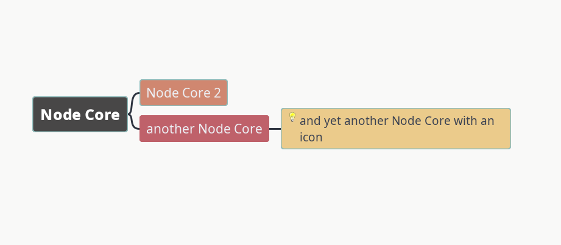

# Understanding nodes
## Node elements
### Overview

Nodes are the fundamental element of mind maps.
Although nodes appear simple at first, they have many optional elements that can increase their functionality.

What appears to be the whole node at first is actually just the [node core](glossary.md#node-core).
If you create a new node and begin typing, the text is entered in the node core by default.
Beginning users generally limit their use of nodes to the node core.

Additional information can be stored in nodes outside the core as node details, node notes, and node attributes.

### Node core

The node core is the only part of the node that is always visible whenever the node itself is visible.
The node core can itself contain several types of information: text (including numbers), icons,  images, and links.

The text in the node core can be interpreted or parsed by Freeplane in different ways, which can be set in the Format Panel drop-down menu `Core text->Format`.
To understand the implications of this setting, see (to be added).

### Node Details

### Node Notes

### Node Attributes

### Edges

### Connectors

Unlike edges, connectors must be added manually, one by one.
To add a connector, select two nodes, `right-click` for a context menu and select `Connect (Ctrl+L)`.
Another way is to `Ctrl+Shift + drag` one node onto another.
On some systems it's also possible to `right-click + drag` one node onto another.

Connectors' properties can be edited (see [Connector styles](#connector-styles)).
To change the shape of a connector, click on the line near a node (it's best to select the node first).
You will see handles appear.
By dragging your mouse up to ~50% of the distance between the nodes, the near handle is adjusted.
Going beyond ~50% or clicking near the middle adjusts both handles at once.
You'll often need to repeat your click-drag-release several times before you get the expected result, i.e. without affecting the far end.

#### Same-node connectors

Both ends of a connector can be attached to the same node, looping back to itself.
To create such a connector, `right-click` a single node and select `Connect (Ctrl+L)` or use any of the other methods described above.

When using `Line` as the type, the connector appears one-ended.
`Line` is often used to draw an arrow going out of a node into empty space (as seen in Freeplane `Help->Tutorial`).

#### Connector styles 

Connectors use styles (see [Styles](styles.md)) just like nodes.

When you `right-click` on a connector, the **Connector** dialog appears.
Here you can set individual formatting properties or select a style (or both), set labels' text and remove the connector.

**Connector Shapes:**

1. `Curve` (default, 1)
2. `Line` (2)
3. `Linear path` (3)
4. `Simulate edge` (4)

`Simulate edge` simulates an normal edge between the nodes.

The other 3 types' shape can be changed using curve-shaping of either end.\
When a connector is added, a style is applied to it, which determines how the connector looks like.
By default, it's the **Default** style.
There's an option to apply a style based on the connector style defined on the source or the target node.
To use it, turn it on in `Preferences (Ctrl+COMMA) -> Defaults -> Connectors -> Assigns node dependant styles to new connectors`.
If the source node has a style applied which has a connector style defined, the style is applied to the connector.
Otherwise, the target node is checked for the same.

## Types of nodes

In addition to standard nodes, there are some special types of nodes:

1. the root node
2. free nodes

### The root node
Every mind map begins with a central node called the root node.
Node levels are defined based on their distance from the root node.

### Free nodes

Free nodes are nodes that appear separate from the map hierarchy.
They are "free" because they can be freely positioned around the map.
They are not automatically positioned like other nodes and they generally do not affect other nodes when they are changed or moved.

Note: although free nodes are positioned independently, technically, they are first-level nodes that are invisibly connected to the root node.
You can add children, parents, or siblings to free nodes, but you may get unexpected behaviors.

Technically, a free node is simply a node with three features:

* they are given the style `Floating node`, which connects to other nodes with invisible edges
* they have the toggle at menu item `Edit->Position node independently` set to "on"
* their oval positioning handle is filled and blue rather than unfilled and red

Other nodes can also be given the style `Floating node` and can be set to be positioned independently.

### Clone nodes
### Node groups
#### Summary nodes

Summary nodes have brackets that suggest that their content summarizes a group of sibling nodes.
Technically, summary nodes are specially marked sibling nodes of the summarized  
nodes.
Summary nodes can include other summary nodes within their brackets, creating the impression of a "reverse" map with branches joining rather than splitting.

Summary node brackets are unusual in that, unlike most Freeplane elements, their appearance is not (currently) customizable.

#### Node clouds

## Node position

## Node view options

#### Hide nodes (per-node setting)

#### Show hidden nodes

#### Minimize nodes

#### Hide node details

#### Hide/show node attributes

#### Tool tips

## Other resources

